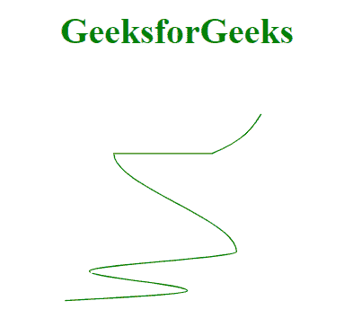

# D3.js curveMonotoneY()方法

> 原文:[https://www.geeksforgeeks.org/d3-js-curvemonotoney-method/](https://www.geeksforgeeks.org/d3-js-curvemonotoney-method/)

**D3 . curvemonotoney**插值器假设数据是根据 y 坐标排序的，否则它会相应地对数据进行排序。这种曲线方法产生一个三次样条曲线，它在 x 方向保持单调性，在 y 方向保持单调性

**语法:**

```
d3.curveMonotoneY()

```

**参数:**此方法不接受任何参数。

**返回值:**此方法不返回值。

**例 1:**

## 超文本标记语言

```
<!DOCTYPE html>
<html>
<head>
  <script src=
"https://cdnjs.cloudflare.com/ajax/libs/d3/4.2.2/d3.min.js">
  </script>
</head>
<body>
  <h1 style="text-align: center;
             color: green;">
    GeeksforGeeks
  </h1>
  <center>
    <svg id="gfg" width="250" height="250">
    </svg>
  </center>
  <script>
    var data = [
      { x: 0, y: 0 },
      { x: 1, y: 3 },
      { x: 2, y: 15 },
      { x: 5, y: 1 },
      { x: 6, y: 15 },
      { x: 7, y: 5 },
      { x: 8, y: 19 }];

    // Sorting the points by y axis
    data.sort((a, b) => a.y - b.y);

    var xScale = d3.scaleLinear()
        .domain([0, 8])
        .range([25, 200]);
    var yScale = d3.scaleLinear()
        .domain([0, 20])
        .range([200, 25]);

    var line = d3.line()
      .x((d) => xScale(d.x))
      .y((d) => yScale(d.y))
      .curve(d3.curveMonotoneY);

    d3.select("#gfg")
      .append("path")
      .attr("d", line(data))
      .attr("fill", "none")
      .attr("stroke", "green");
  </script>
</body>
</html>
```

**输出:**



**示例 2:** 按 x 轴对未排序的点进行排序，然后渲染曲线。

## 超文本标记语言

```
<!DOCTYPE html>
<html>
<head>
  <script src=
"https://cdnjs.cloudflare.com/ajax/libs/d3/4.2.2/d3.min.js">
  </script>
</head>
<body>
  <h1 style="text-align: center; 
             color: green;">
    GeeksforGeeks
  </h1>
  <center>
    <svg id="gfg" width="250" height="200">
    </svg>
  </center>
  <script>
    var points = [
      { xpoint: 75, ypoint: 150 },
      { xpoint: 25, ypoint: 5 },
      { xpoint: 150, ypoint: 150 },
      { xpoint: 100, ypoint: 5 },
      { xpoint: 200, ypoint: 150 }];

    // Sorting the points by y axis
    points.sort((a, b) => a.ypoint - b.ypoint);

    var Gen = d3.line()
      .x((p) => p.xpoint)
      .y((p) => p.ypoint)
      .curve(d3.curveMonotoneY);

    d3.select("#gfg")
      .append("path")
      .attr("d", Gen(points))
      .attr("fill", "none")
      .attr("stroke", "green");

  </script>
</body>
</html>
```

**输出:**

