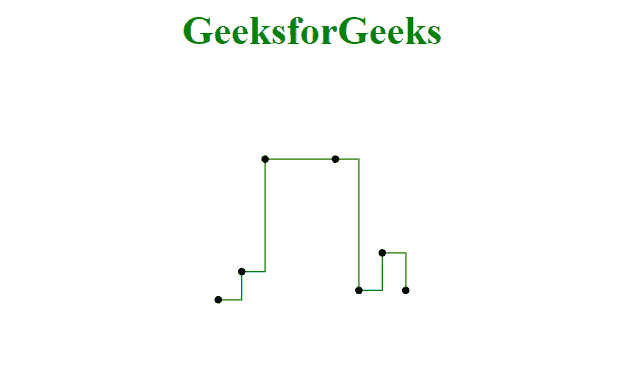
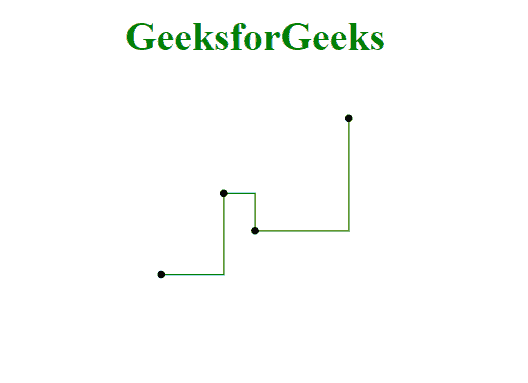

# D3 . js curvestepaafter()方法

> 原文:[https://www.geeksforgeeks.org/d3-js-curvestepafter-method/](https://www.geeksforgeeks.org/d3-js-curvestepafter-method/)

阶跃曲线插值器创建代表阶跃函数的垂直线和水平线。为数据集中的每对点创建一条垂直线。对于每对点，垂直线位于第二点的 x 坐标处。

**语法:**

```html
d3.curveStepAfter()

```

**参数:**该方法不取参数

**返回值:**此方法不返回任何内容。

**例 1:**

## 超文本标记语言

```html
<!DOCTYPE html>
<html>
<meta charset="utf-8">
<head>
  <title>d3.curveStepAfter()</title>
</head>
<script src="https://cdnjs.cloudflare.com/ajax/libs/d3/4.2.2/d3.min.js"></script>

<body>
    <h1 style="text-align: center; color: green;">GeeksforGeeks</h1>
  <center>
    <svg id="gfg" width="200" height="200"></svg>
</center>
  <script>
var data = [
  {x: 0, y: 0},
  {x: 1, y: 3},
  {x: 2, y: 15},
  {x: 5, y: 15},
  {x: 6, y: 1},
  {x: 7, y: 5},
  {x: 8, y: 1}];

var xScale = d3.scaleLinear().domain([0, 8]).range([25, 175]);
var yScale = d3.scaleLinear().domain([0,20]).range([175, 25]);

var line = d3.line()
  .x((d) => xScale(d.x))
  .y((d) => yScale(d.y))
  // curveStepAfter is used
  .curve(d3.curveStepAfter);

d3.select("#gfg")
  .append("path")
  .attr("d", line(data))
  .attr("fill", "none")
  .attr("stroke", "green");

// Defining points
d3.select('#gfg')
  .selectAll('circle')
  .data(data)
  .enter()
  .append('circle')
  .attr('cx', (d) => xScale(d.x))
  .attr('cy', (d) => yScale(d.y))
  .attr('r', 3);

</script>
</body>
</html>
```

**输出:**



**例 2:**

## 超文本标记语言

```html
<!DOCTYPE html>
<html>
<meta charset="utf-8">
<head>
  <title>d3.curveStepAfter()</title>
</head>
<script src="https://cdnjs.cloudflare.com/ajax/libs/d3/4.2.2/d3.min.js"></script>

<body>
    <h1 style="text-align: center; color: green;">GeeksforGeeks</h1>
  <center>
    <svg id="gfg" width="200" height="200"></svg>
</center>
  <script>
var points = [
  {xpoint: 25,  ypoint: 150},
  {xpoint: 75,  ypoint: 85},
  {xpoint: 100, ypoint: 115},
  {xpoint: 175, ypoint: 25}];

var Gen = d3.line()
  .x((p) => p.xpoint)
  .y((p) => p.ypoint)
  .curve(d3.curveStepAfter);

d3.select("#gfg")
  .append("path")
  .attr("d", Gen(points))
  .attr("fill", "none")
  .attr("stroke", "green");
// Defining points
d3.select('#gfg')
  .selectAll('circle')
  .data(points)
  .enter()
  .append('circle')
  .attr('cx', (d) => (d.xpoint))
  .attr('cy', (d) => (d.ypoint))
  .attr('r', 3);
</script>
</body>
</html>
```

**输出:**

