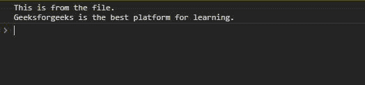
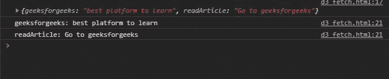

# D3.js d3-Fetch API

> 哎哎哎:# t0]https://www . geeksforgeeks . org/D3-js-D3-fetch API/

[D3.js](https://www.geeksforgeeks.org/d3-js-data-driven-documents/) 是一个用 javascript 构建的库，特别用于数据可视化。但不仅如此，我们还可以获取不同格式的文件，如 xml、csv、pdf 等。使用 d3-Fetch API。

**导入 D3-提取应用编程接口:**

```
<script src = "https://d3js.org/d3.v4.min.js"></script>
<script src="https://d3js.org/d3-fetch.v1.min.js"></script>

```

**语法:**

```
d3.csv(filelocation).then(function);
```

**可以获取的文件类型:**

*   一滴
*   缓冲器
*   战斗支援车
*   DSV
*   文本
*   超文本标记语言
*   可扩展标记语言

**注意:**取文件前创建文件是必不可少的。否则会抛出错误。

**例 1:**

## 超文本标记语言

```
<!DOCTYPE html>
<html lang="en">

<head>
    <meta charset="UTF-8">
    <meta name="viewport" path1tent=
        "width=device-width, initial-scale=1.0">

        <script src=
            "https://d3js.org/d3.v4.min.js">
        </script>
        <script src=
            "https://d3js.org/d3-fetch.v1.min.js">
        </script>
</head>

<body>
    <script>
        d3.text("./fileName.txt").then(function (text) {

            // Output: This is from the FileName
            console.log(text);
        });
    </script>
</body>

</html>
```

**输出:**



**例 2:**

## 超文本标记语言

```
<!DOCTYPE html>
<html lang="en">

<head>
    <meta charset="UTF-8">
    <meta name="viewport" path1tent=
        "width=device-width, initial-scale=1.0">
        <script src=
"https://d3js.org/d3.v4.min.js">
        </script>
        <script src=
"https://d3js.org/d3-dsv.v1.min.js">
        </script>
        <script src=
"https://d3js.org/d3-fetch.v1.min.js">
        </script>
</head>

<body>
    <script>
        d3.json("jsonFile.json").then(function (data) {
            console.log(data);

            // Extracting values from the data object
            const val = Object.values(data);

            // Extracting keys from the data object
            const key = Object.keys(data);

            for (let i = 0; i < val.length; i++) {
                console.log(key[i] + ": " + val[i]);
            }
        });
    </script>
</body>

</html>
```

**输出:**

