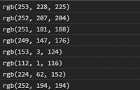
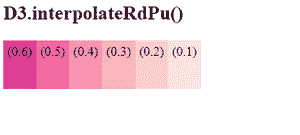

# D3.js d3 .插值 eRdPu()函数

> 原文:[https://www . geesforgeks . org/D3-js-D3-interprederpu-function/](https://www.geeksforgeeks.org/d3-js-d3-interpolaterdpu-function/)

d3.js 中的**D3 . interpreverdpu()**函数用于返回与“RdPu”的顺序配色方案相对应的颜色。该函数返回的颜色是 RGB 格式。此功能设置红色和紫色之间的颜色范围。给定的值介于 0 和 1 之间，包括 0 和 1。

**语法:**

```
d3.interpolateRdPu(t);
```

**参数:**该函数采用如上所述的单个参数，描述如下:

*   **t:** 该参数取一个在[0，1]范围内的数字。

**返回值:**这个函数返回一串 RGB 格式的颜色。

下面是上面给出的函数的几个例子。

**例 1:**

## 超文本标记语言

```
<html lang="en">

<head>
    <meta charset="UTF-8">
    <meta name="viewport" content="width=device-width, 
                initial-scale=1.0">

    <!--Fetching from CDN of D3.js -->
    <script src="https://d3js.org/d3.v6.min.js">
    </script>
</head>

<body>
    <script>
        console.log(d3.interpolateRdPu(0.1));
        console.log(d3.interpolateRdPu(0.2));
        console.log(d3.interpolateRdPu(0.3));
        console.log(d3.interpolateRdPu(0.4));
        console.log(d3.interpolateRdPu(0.8));
        console.log(d3.interpolateRdPu(0.9));
        console.log(d3.interpolateRdPu(0.6));
        console.log(d3.interpolateRdPu(0.254));
    </script>
</body>

</html>
```

**输出:**

[](https://media.geeksforgeeks.org/wp-content/uploads/20200824200404/01-200x129.PNG)

**例 2:**

## 超文本标记语言

```
<!DOCTYPE html>
<html lang="en">

<head>
    <meta charset="UTF-8" />
    <meta name="viewport" content="width=device-width, 
                    initial-scale=1.0" />

    <!--Fetching from CDN of D3.js -->
    <script src="https://d3js.org/d3.v6.min.js">
    </script>

    <style>
        div {
            padding: 5px;
            text-align: center;
            vertical-align: middle;
            display: flex;
            justify-content: center;
            width: fit-content;
            height: 50px;
            float: left;
        }
    </style>
</head>

<body>
    <h2>D3.interpolateRdPu()</h2>
    <div class="box1">
        <span>
            (0.6)
        </span>
    </div>
    <div class="box2">
        <span>
            (0.5)
        </span>
    </div>
    <div class="box3">
        <span>
            (0.4)
        </span>
    </div>
    <div class="box4">
        <span>
            (0.3)
        </span>
    </div>
    <div class="box5">
        <span>
            (0.2)
        </span>
    </div>
    <div class="b6">
        <span>
            (0.1)
        </span>
    </div>
    <script>
        // Creating different colors for different
        // Values of t as 0.6,0.5...  
        let color1 = d3.interpolateRdPu(0.6);
        let color2 = d3.interpolateRdPu(0.5);
        let color3 = d3.interpolateRdPu(0.4);
        let color4 = d3.interpolateRdPu(0.3);
        let color5 = d3.interpolateRdPu(0.2);
        let color6 = d3.interpolateRdPu(0.1);

        // Selecting Div using query selector 
        let box1 = document.querySelector(".box1");
        let box2 = document.querySelector(".box2");
        let box3 = document.querySelector(".box3");
        let box4 = document.querySelector(".box4");
        let box5 = document.querySelector(".box5");
        let b6 = document.querySelector(".b6");

        // Setting style and BG color of 
        /// the particular DIVs 
        box1.style.backgroundColor = color1;
        box2.style.backgroundColor = color2;
        box3.style.backgroundColor = color3;
        box4.style.backgroundColor = color4;
        box5.style.backgroundColor = color5;
        b6.style.backgroundColor = color6; 
    </script>
</body>

</html>
```

**输出:**

[](https://media.geeksforgeeks.org/wp-content/uploads/20200824200904/01-300x135.PNG)