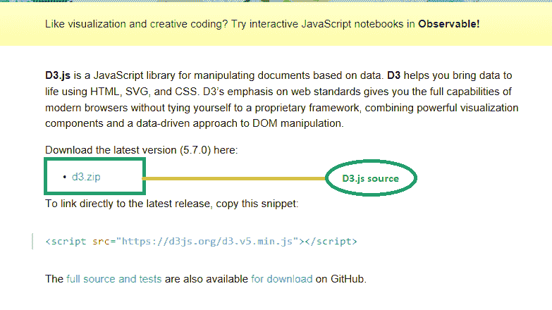
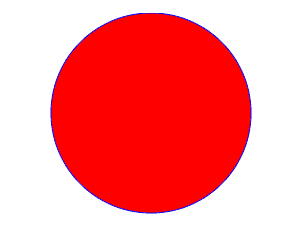
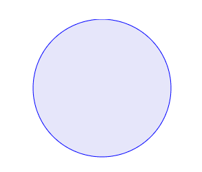

# D3。JS(数据驱动文档)

> 原文:[https://www.geeksforgeeks.org/d3-js-data-driven-documents/](https://www.geeksforgeeks.org/d3-js-data-driven-documents/)

**简介:**D3 是 Data Driven Documents 的缩写，D3.js 是基于数据管理文档的资源 JavaScript 库。D3 是最有效的数据可视化框架之一。它允许开发人员在浏览器中借助 HTML、CSS 和 SVG 创建动态的、交互式的数据可视化。数据可视化是以图片和图形的形式表示过滤后的数据。轻松呈现复杂数据集的图形或图片表示。此外，在数据可视化的帮助下，可以很容易地跟踪比较分析或模式，从而使客户能够在没有太多头脑风暴的情况下做出决策。这种可视化可以很容易地使用框架来开发，例如编写 D3 框架的 D3.js. *迈克·博斯托克*。在 D3 之前，Protovis 工具包被广泛用于数据可视化。虽然有许多其他的数据可视化框架，但是 D3.js 由于其灵活性和可学习性而留下了自己的足迹。
D3 不是作为一个提供所有可能特性的整体框架工作，而是通过提供有效的数据操作来解决问题的核心。它减少了开销并允许灵活性。

**特点:**有很多其他的平台或者框架可以用来管理数据可视化，但是 D3 因为极其灵活，把其他的框架都甩在了后面。以下是 D3 与其他框架的主要区别:

*   由于 D3 使用的是 HTML、CSS、SVG 等网络标准。它呈现强大的可视化图形。
*   数据驱动方法允许 D3 从不同的网络节点或服务器检索数据，并进一步分析它以呈现可视化。此外，它还可以使用静态数据进行处理。
*   D3 允许图形创建工具的变化。它是一个基本的结构化表格或分析良好的饼图。它的库从最基本的工具到高级的资源都有。即使是复杂的地理信息系统制图也可以使用 D3 来完成。甚至它允许根据需要定制可视化。然而，由于它对网络标准的支持，这一切都是可能的。
*   它甚至支持大型数据集，并充分利用其预定义的库，从而使用户能够重用代码。
*   支持过渡和动画，D3 隐式管理逻辑。因此，人们不需要显式地管理或创建它们。动画渲染响应迅速，支持内部状态之间的快速传输。
*   D3 的一个关键特性是它支持 DOM 操作，并且足够灵活，可以动态管理其处理程序的属性。

**语法:**
D3 使用 JavaScript 函数执行大部分*选择、转换和数据绑定任务*。CSS 在组件的样式设计中也起着关键作用。此外，JavaScript 函数可以用这样一种方式编写脚本，即它们可以读出其他格式的数据。

*   **Selection:** Before working on a dataset, the major task to be carried out is selection, i.e. retrieval of data from dataset. D3 enables the selection task by passing a predetermined tag as a parameter to the select function.

    ```
    d3.selectAll("pre")   // It select all elements defined under the <pre> tag
      .style("color", "cyan"); // set style "color" to value "cyan" color
    ```

    类似地，可以在特定标签下定义的各种数据集上工作。selectAll()的参数可以是标记、类、标识符或属性。元素可以修改、添加、删除或操作，所有这些都完全基于数据。

*   **Transitions:** Transitions can make the values and attributes for a dataset dynamic.

    ```
    d3.selectAll("pre")     // select all <pre> elements
       .transition("transitionEx") // Declaring transition named as "transitionEx"
         .delay(10)          // transition starting after 10ms
         .duration(50);      // transitioning during 50ms
    ```

    在上面的场景中，请注意，对于作为 pre tag 子集出现的所有元素，都会相应地转换。

对于更高级的用途，D3 利用加载的数据来创建对象和进行操作，相应地完成属性添加和转换。所有这些操作都属于数据绑定部分。

**设置 D3.js 环境:**为了将 D3 用于网站或网页，首先需要注意的是其安装或将库导入到网页中。

1.  D3 是一个开源库。源代码可在 [D3.js 网站](https://d3js.org/)免费获取。下载该库的最新版本。(目前为 5 . 7 . 0)
    从源码链接下载 D3 库【/题注】
2.  Unzip the .zip file which obtained after the completion of download. Locate the d3.min.js file which is the minimal version of D3 source code. Copy that file and include it in the root folder or the main library directory of web page. In webpage, include the d3.min.js file as shown.

    ```
    <!DOCTYPE html>
    <html lang="en">
        <head>

            <!--Adding the source file of D3 here -->
            <script src="../d3.min.js"></script>
        </head>

        <body>
            <script>

                // write your own d3 code here 
            </script>
        </body>
    </html>
    ```

    **注意:** D3 不支持 Internet Explorer 8 或其更低版本。最好使用 Safari/ Mozilla Firefox 或 Chrome。

3.  **Example:** The basic example shown below demonstrates the use of D3 for SVG object creation i.e. circle in scenario within in a HTML document.

    ```
    <!DOCTYPE html>
    <htm>
    <meta charset="utf-8">
    <body>
    <svg width="960" height="500"></svg>
    <script src="https://d3js.org/d3.v4.min.js"></script>

    <body>
        <div id="circle"></div>

        // Declaring the script type 
        <script type="text/javascript">

            // Creating a variable to store SVG attributes
            var myGraphic = d3.select("#circle")

            // applying the svg type attribute 
            .append("svg")  

            // initializing the width of the object pane
            .attr("width", 500)  

            // initializing the height of the object pane
            .attr("height", 500);     

        myGraphic.append("circle")

            // Outline color attribute set to blue
            .style("stroke", "blue") 

            // Fill color attribute set to red
            .style("fill", "red")  

            // Radius attribute set to 100
            .attr("r", 100)

            // X-coordinate set to 300px
            .attr("cx", 300) 

            // Y-coordinate set to 100px
            .attr("cy", 100)         

             // applying action when the mouse pointer hovers over the circle
            .on("mouseover", function(){d3.select(this).style("fill", "lavender");})
            .on("mouseout", function(){d3.select(this).style("fill", "red");});

        </script>
    </body>
    </html>
    ```

    **输出:**
    **鼠标移过前:**
    
    **鼠标移过后:**
    

    此外，使用 D3 框架，动画、过渡、属性可以更轻松地添加和操作。动作处理的所有工作都可以使用助手函数来完成。在上例中，select()函数执行检索参数的任务，而 append()将属性作为子级添加到所选参数中。D3 侧重于抽象，因此大多数内部动作或执行对最终用户来说是隐藏的，因此更容易使用。绑定事件的任务是在上述情况下借助。on()函数，将鼠标事件作为参数传递。值得注意的是，在 D3 框架中使用了匿名函数概念。这里，匿名函数作为参数传递。
    使用 D3 框架可以完成更复杂的操作，例如从不同格式的数据集检索数据，例如。csv 或 JSON 文件。

    **优势:**

    *   D3 支持所有程序员都知道的 HTML、CSS、SVG 等 web 标准，因此任何人都可以轻松使用。简而言之，D3 展示了 HTML5、CSS3 和 SVG 等网络标准的功能。
    *   它相当轻量级和灵活，代码是可重用的，因此更可取。
    *   它为用户管理可视化和数据提供了比其他可用的应用编程接口或框架更广泛的控制。
    *   作为一个开源框架，人们可以根据自己的需要轻松操作 D3 的源代码。

    **缺点:**

    *   D3 与旧版本的浏览器不兼容。在这种情况下，如果有人希望以向后兼容的方式可视化数据，由于兼容性差，可视化可能必然是静态的。
    *   安全性对 D3 来说仍然是一个挑战。使用 D3 不容易隐藏或保护数据。

    **应用:**其优势在各种数据可视化领域较为可取。使用 D3 的一些主要领域如下:

    *   基本图表和图形分析可视化。
    *   网络可视化。
    *   数据仪表板开发模块。
    *   网络地图创建和合成。
    *   交互式数据表示。

        **相关文章:**[HTML | SVG-基础](https://www.geeksforgeeks.org/html-svg-basics/)