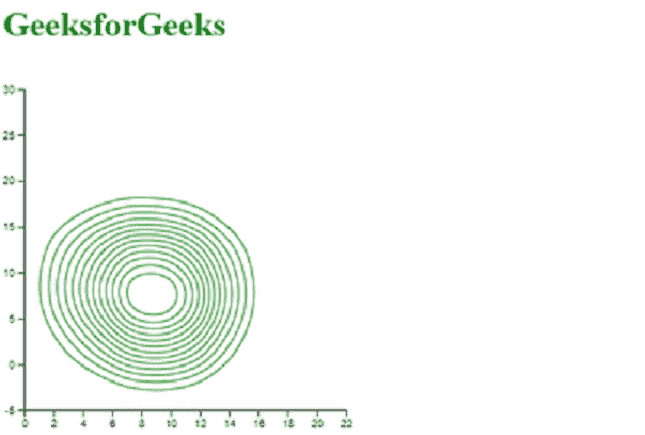

# D3.js 密度.带宽()函数

> 原文:[https://www . geesforgeks . org/D3-js-密度-带宽-功能/](https://www.geeksforgeeks.org/d3-js-density-bandwidth-function/)

**密度带宽()**函数用于设置密度估计器函数的带宽。如果未指定带宽，则设置等于 20.4939 的默认带宽。如果指定了带宽，则设置高斯核的带宽并返回估计值。

**语法:**

```
d3.contourDensity.x().y().bandwidth([bandwidth]);

```

**参数:**该函数取一个参数，如上所述，如下所述。

*   **带宽:**该函数取一个定义密度估计器函数带宽的数字。

**返回值:**这个函数不返回任何东西。

下面给出了几个密度带宽函数的例子。

**例 1:**

## 超文本标记语言

```
<!DOCTYPE html> 
<html lang="en"> 

<head> 
    <meta charset="UTF-8"> 
    <meta name="viewport" content=" 
        width=device-width, initial-scale=1.0"> 

    <script type="text/javascript"
        src="https://d3js.org/d3.v4.min.js"> 
    </script> 
    <script src="https://d3js.org/d3-contour.v1.min.js">
    </script>
</head> 

<body> 
    <h1 style="color:green">GeeksforGeeks</h1>

    <script> 
        // append the svg object to the body.
        var svg = d3.select("body")
        .append("svg")
            .attr("width", 500)
            .attr("height", 500)
        .append("g")
            .attr("transform",
                "translate(" + 20 + ", " + -80 + ")");

        // read data
        d3.csv("./data.csv", function(data) {

        var y = d3.scaleLinear()
            .domain([-5, 30])
            .range([ 400, 100 ]);

        var x = d3.scaleLinear()
            .domain([0, 22])
            .range([ 0, 300]);

        svg.append("g")
        .call(d3.axisLeft(y));

        svg.append("g")
            .attr("transform", "translate(0, " + 400 + ")")
            .call(d3.axisBottom(x));

        var density= d3.contourDensity()
            .y(function(d) { return y(d.y); })
            .x(function(d) { return x(d.x); })
            // Use of bandwidth() Function
            .bandwidth(40)
            (data)

        svg.selectAll("path")
            .data(density)
            .enter()
            .append("path")
            .attr("d", d3.geoPath())
            .attr("fill", "none")
            .attr("stroke", "green")
        });

        // Data for csv file
        // x, y, group
        // 9.45, 4.4, H
        // 9.1, 4.4, H
        // 9.9, 9.9, H
        // 9.6, 4.5, H
        // 9.1, 9.7, H
        // 4.7, 9.5, H
        // 7.9, 9.6, H
        // 4.7, 9.7, H
        // 9.45, 4.4, H
        // 12.1, 9.4, H
        // 7.5, 9, H
        // 4.5, 4.5, H
        // 9.45, 9.7, H
        // 4.45, 9.6, H
        // 9.5, 7.6, H
        // 9, 9.45, H
        // 4.7, 12, H
        // 9.7, 9.7, H
        // 9.6, 9, H
        // 12, 9, H
        // 9.45, 4.5, H
        // 9.9, 4.6, H
        // 12.7, 9.9, H
        // 9, 12.4, H
        // 9, 4.9, H
        // 9.5, 9.7, H
        // 9.7, 4.7, H
        // 9.9, 4.5, H
        // 4, 4.5, H
        // 7.9, 9, H
        // 9.9, 9.45, H
        // 9, 4.4, H
        // 4.7, 9.7, H
        // 4.5, 9.9, H
    </script> 
</body>
</html> 
```

**输出:**



**例 2:**

## 超文本标记语言

```
<!DOCTYPE html> 
<html lang="en"> 

<head> 
    <meta charset="UTF-8"> 
    <meta name="viewport" content=" 
        width=device-width, initial-scale=1.0"> 

    <script type="text/javascript"
        src="https://d3js.org/d3.v4.min.js"> 
    </script> 
    <script src="https://d3js.org/d3-contour.v1.min.js">
    </script>
</head> 

<body> 
    <h1 style="color:green">GeeksforGeeks</h1>

    <script> 

        // append the svg object to the body.
        var svg = d3.select("body")
        .append("svg")
            .attr("width", 500)
            .attr("height", 500)
        .append("g")
            .attr("transform",
                "translate(" + 20 + ", " + -80 + ")");

        // read data
        d3.csv("./data.csv", function(data) {

        var y = d3.scaleLinear()
            .domain([-5, 30])
            .range([ 400, 100 ]);

        var x = d3.scaleLinear()
            .domain([0, 22])
            .range([ 0, 300]);

        svg.append("g")
        .call(d3.axisLeft(y));

        svg.append("g")
            .attr("transform", "translate(0, " + 400 + ")")
            .call(d3.axisBottom(x));

        var density= d3.contourDensity()
            .y(function(d) { return y(d.y); })
            .x(function(d) { return x(d.x); })
            // Use of bandwidth() Function
            .bandwidth(10)
            (data)

        svg.selectAll("path")
            .data(density)
            .enter()
            .append("path")
            .attr("d", d3.geoPath())
            .attr("fill", "none")
            .attr("stroke", "green")
        });

        // Data for csv file
        // x, y, group
        // 9.45, 4.4, H
        // 9.1, 4.4, H
        // 9.9, 9.9, H
        // 9.6, 4.5, H
        // 9.1, 9.7, H
        // 4.7, 9.5, H
        // 7.9, 9.6, H
        // 4.7, 9.7, H
        // 9.45, 4.4, H
        // 12.1, 9.4, H
        // 7.5, 9, H
        // 4.5, 4.5, H
        // 9.45, 9.7, H
        // 4.45, 9.6, H
        // 9.5, 7.6, H
        // 9, 9.45, H
        // 4.7, 12, H
        // 9.7, 9.7, H
        // 9.6, 9, H
        // 12, 9, H
        // 9.45, 4.5, H
        // 9.9, 4.6, H
        // 12.7, 9.9, H
        // 9, 12.4, H
        // 9, 4.9, H
        // 9.5, 9.7, H
        // 9.7, 4.7, H
        // 9.9, 4.5, H
        // 4, 4.5, H
        // 7.9, 9, H
        // 9.9, 9.45, H
        // 9, 4.4, H
        // 4.7, 9.7, H
        // 4.5, 9.9, H
    </script> 
</body>
</html> 
```

**输出:**

