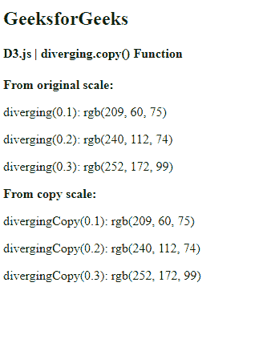
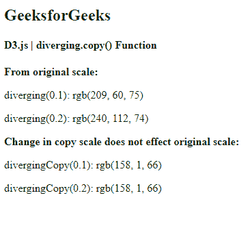

# D3.js 发散. copy()函数

> 原文:[https://www . geesforgeks . org/D3-js-diverging-copy-function/](https://www.geeksforgeeks.org/d3-js-diverging-copy-function/)

**发散音阶**与连续音阶非常相似。唯一的区别是，该标尺的输出范围由插值器固定，因此该范围不可配置。

d3.js 中的**diffusing . copy()**函数用于构造并返回原始比例的精确副本。原始比例的任何变化都不会影响拷贝比例，反之亦然。

**语法:**

```
diverging.copy();
```

**参数:**该功能不取任何参数。

**返回值:**该函数返回原刻度的副本。

下面是上面给出的函数的几个例子。

**例 1:**

```
<!DOCTYPE html> 
<html lang="en"> 
<head> 
    <meta charset="UTF-8" /> 
    <meta name="viewport"
        path1tent="width=device-width, 
        initial-scale=1.0"/> 
    <title>GeekforGeeks</title>
    <script src = 
"https://d3js.org/d3.v6.min.js">
</script>
</head> 
<style>
</style>
<body> 
    <h2 style="color:green"> GeeksforGeeks </h2>
    <h4> D3.js | diverging.copy() Function </h4>
    <script> 
        var diverging = 
d3.scaleDiverging(d3.interpolateSpectral);
        // Default domain is used i.e [0, 1]
        document.write(
        "<b>From original scale: </b>");
        document.write(
"<p>diverging(0.1): ", diverging(0.1) + "</p>");
        document.write(
"<p>diverging(0.2): ", diverging(0.2) + "</p>");
        document.write(
"<p>diverging(0.3): ", diverging(0.3) + "</p>");
        document.write("<b>From copy scale: </b>");
        var divergingCopy = diverging.copy();
        document.write(
"<p>divergingCopy(0.1): ", divergingCopy(0.1) + "</p>");
        document.write(
"<p>divergingCopy(0.2): ", divergingCopy(0.2) + "</p>");
        document.write(
"<p>divergingCopy(0.3): ", divergingCopy(0.3) + "</p>");
    </script> 
</body> 
</html>
```

**输出:**

[](https://media.geeksforgeeks.org/wp-content/uploads/20200824091637/01144.png)

**例 2:**

```
<!DOCTYPE html> 
<html lang="en"> 
<head> 
    <meta charset="UTF-8" /> 
    <meta name="viewport"
        path1tent="width=device-width, 
        initial-scale=1.0"/> 
    <title>GeekforGeeks</title>
    <script src=
"https://d3js.org/d3.v6.min.js"></script>
</head> 
<style>
</style>
<body> 
    <h2 style="color:green"> GeeksforGeeks </h2>
    <h4> D3.js | diverging.copy() Function </h4>
    <script> 
        var diverging = 
d3.scaleDiverging(d3.interpolateSpectral);
        // Default domain is used i.e [0, 1]
        document.write(
        "<b>From original scale: </b>");
        document.write(
"<p>diverging(0.1): ", diverging(0.1) + "</p>");
        document.write(
"<p>diverging(0.2): ", diverging(0.2) + "</p>");
        document.write(
"<b>Change in copy scale does not"+
" effect original scale: </b>");
        var divergingCopy = diverging.copy();
        // Domain is changed to [10, 100]
        divergingCopy.domain([10, 100])
        document.write(
"<p>divergingCopy(0.1): ", divergingCopy(0.1) + "</p>");
        document.write(
"<p>divergingCopy(0.2): ", divergingCopy(0.2) + "</p>");
    </script> 
</body> 
</html>
```

**输出:**

[](https://media.geeksforgeeks.org/wp-content/uploads/20200824091913/01145.png)