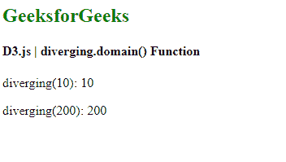

# D3.js 发散域()函数

> 原文:[https://www . geesforgeks . org/D3-js-diverging-domain-function/](https://www.geeksforgeeks.org/d3-js-diverging-domain-function/)

**发散音阶**与连续音阶非常相似。唯一的区别是，该标尺的输出范围由插值器固定，因此该范围不可配置。

**发散域()**功能用于设置标尺的域。域数组必须采用三个数值。

**语法:**

```
diverging.domain([domain]);
```

**参数:**该函数接受如上所述的单个参数，如下所述:

*   **域:**这是一个取三个数值的数组。刻度的默认范围是[0，0.5，1]。

**返回值:**这个函数不返回任何东西。

**例 1:**

## 超文本标记语言

```
<!DOCTYPE html>
<html lang="en">

<head>
    <meta charset="UTF-8" />
    <meta name="viewport" path1tent=
        "width=device-width,initial-scale=1.0" />

    <script src="https://d3js.org/d3.v6.min.js">
    </script>
</head>

<body>
    <h2 style="color:green"> GeeksforGeeks </h2>

    <h4> D3.js | diverging.domain() Function </h4>

    <script>
        var diverging = d3.scaleDiverging()

            // Setting domain of the scale
            .domain([4, 0.001, 100]);

        document.write("<p>diverging(1): ", 
                diverging(1) + "</p>");

        document.write("<p>diverging(2): ", 
                diverging(2) + "</p>");
    </script>
</body>

</html>
```

**输出:**

[](https://media.geeksforgeeks.org/wp-content/uploads/20200824100749/01148.png)

**例 2:**

## 超文本标记语言

```
<!DOCTYPE html>
<html lang="en">

<head>
    <meta charset="UTF-8" />
    <meta name="viewport" path1tent=
        "width=device-width, initial-scale=1.0"/>

    <script src="https://d3js.org/d3.v6.min.js">
    </script>
</head>

<body>
    <h2 style="color:green"> GeeksforGeeks </h2>

    <h4> D3.js | diverging.domain() Function </h4>

    <script>
        var diverging = d3.scaleDiverging();
        // Default scale is identity function

        document.write("<p>diverging(10): ", 
                    diverging(10) + "</p>");

        document.write("<p>diverging(200): ", 
                    diverging(200) + "</p>");
    </script>
</body>

</html>
```

**输出:**

[](https://media.geeksforgeeks.org/wp-content/uploads/20200824100916/01149.png)