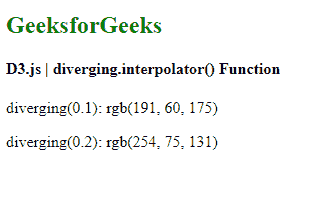
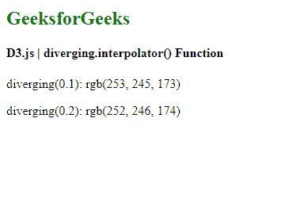

# D3.js 发散插值器()功能

> 原文:[https://www . geesforgeks . org/D3-js-diffusing-interpreter-function/](https://www.geeksforgeeks.org/d3-js-diverging-interpolator-function/)

**发散音阶**与连续音阶非常相似。唯一的区别是，该标尺的输出范围由插值器固定，因此该范围不可配置。

**发散插值()**功能用于配置发散标尺的插值器。如果未指定插值器，它会将标尺的插值器设置为指定的函数。

**语法:**

```
diverging.interpolator([interpolator]);
```

**参数:**该功能接受如上所述的单个参数，描述如下:

*   **插值器:**该参数接受插值器功能。

**返回值:**这个函数不返回任何东西。

下面是上面给出的函数的几个例子。

**例 1:**

```
<!DOCTYPE html> 
<html lang="en"> 
<head> 
    <meta charset="UTF-8" /> 
    <meta name="viewport"
        path1tent="width=device-width, 
        initial-scale=1.0"/> 
    <title>GeekforGeeks</title>
    <script src="https://d3js.org/d3.v6.min.js"></script>
</head> 
<style>
</style>
<body> 
    <h2 style="color:green"> GeeksforGeeks </h2>
    <h4> D3.js | diverging.interpolator() Function </h4>
    <script> 
        var diverging = d3.scaleDiverging()
        // Setting the interpolate function
                        .interpolator(d3.interpolateRainbow);
        // Default domain is used i.e [0, 1]
        document.write(
            "<p>diverging(0.1): ", diverging(0.1) + "</p>");
        document.write(
            "<p>diverging(0.2): ", diverging(0.2) + "</p>");
    </script> 
</body> 
</html>
```

**输出:**

[](https://media.geeksforgeeks.org/wp-content/uploads/20200824095208/01146.png)

**例 2:**

```
<!DOCTYPE html> 
<html lang="en"> 
<head> 
    <meta charset="UTF-8" /> 
    <meta name="viewport"
        path1tent="width=device-width, 
        initial-scale=1.0"/> 
    <title>GeekforGeeks</title>
    <script src="https://d3js.org/d3.v6.min.js"></script>
</head> 
<style>
</style>
<body> 
    <h2 style="color:green"> GeeksforGeeks </h2>
    <h4> D3.js | diverging.interpolator() Function </h4>
    <script> 
        var diverging = d3.scaleDiverging()
        // Setting the interpolate function
                        .interpolator(d3.interpolateSpectral)
        // Setting up the domain
                        .domain([1, 0.5, 10]);
        // Default domain is used i.e [0, 1]
        document.write(
            "<p>diverging(0.1): ", diverging(0.1) + "</p>");
        document.write(
            "<p>diverging(0.2): ", diverging(0.2) + "</p>");
    </script> 
</body> 
</html>
```

**输出:**

[](https://media.geeksforgeeks.org/wp-content/uploads/20200824095417/01147.png)