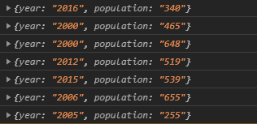
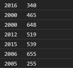

# D3.js dsv()功能

> 原文:[https://www.geeksforgeeks.org/d3-js-dsv-function/](https://www.geeksforgeeks.org/d3-js-dsv-function/)

D3.js 中的 **d3.dsv()** 函数是请求 API 的一部分，它返回对 dsv 类型文件的请求。mime 类型是文本/DSV。可以指定一个可选的行转换函数来映射和过滤行对象。

**语法:**

```
d3.dsv(delimiter, inputfile, function);

```

**参数:**该功能接受三个参数，如上所述，描述如下:

*   **分隔符:**分隔各列的是分隔的如“、”或“-”等。
*   **输入文件:**是输入文件的位置。
*   **功能:**是用户自定义的功能，执行一定的动作来处理数据。

下面是上面给出的函数的几个例子。

**注意:**请先创建并保存一个文件名 sample.dsv，然后再继续代码。

**示例 1:**

## 超文本标记语言

```
<!DOCTYPE html>
<html lang="en">
    <head>
        <meta charset="UTF-8" />
        <meta
            name="viewport"
            path1tent="width=device-width, 
                       initial-scale=1.0"/>
        <title>D3.js dsv() Function</title>
    </head>
    <style></style>
    <body>
        <script src=
"https://d3js.org/d3.v4.min.js">
        </script>
        <script src=
"https://d3js.org/d3-dsv.v1.min.js">
        </script>
        <script src=
"https://d3js.org/d3-fetch.v1.min.js">
        </script>

        <script>
            d3.dsv(",", "sample.dsv", (data) => {
                console.log(data);
            });
        </script>
    </body>
</html>
```

**输出:**



**例 2:** 当分隔符为" "(空格)时

## 超文本标记语言

```
<!DOCTYPE html>
<html lang="en">
    <head>
        <meta charset="UTF-8" />
        <meta
            name="viewport"
            path1tent="width=device-width, 
                       initial-scale=1.0"/>
        <title>D3.js dsv() Function</title>
    </head>
    <style></style>
    <body>
        <script src=
"https://d3js.org/d3.v4.min.js">
        </script>
        <script src=
"https://d3js.org/d3-dsv.v1.min.js">
        </script>
        <script src=
"https://d3js.org/d3-fetch.v1.min.js">
        </script>

        <script>
            d3.dsv(" ", "sample.dsv", (data) => {
                console.log(data.year, " ", data.population);
            });
        </script>
    </body>
</html>
```

**输出:**

