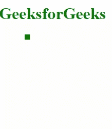

# D3.js easepoly()功能

> 原文:[https://www.geeksforgeeks.org/d3-js-easepoly-function/](https://www.geeksforgeeks.org/d3-js-easepoly-function/)

d3.js 中的 **d3.easePoly()** 函数用于给特定元素赋予对称多项式效果。该聚合缓和函数用作 **d3 .缓和()**函数中的参数。

**方法:** D3.js 转换函数将用于对特定元素应用不同的缓和效果。首先，创建一个 SVG 元素并将其附加到 HTML 页面的正文中，然后创建一个圆并将其附加到 SVG 中。设置圆的一些属性，使其具有良好的颜色和大小，并应用 d3.transition 函数，后跟 ease()函数，并将 d3.easePoly 作为参数应用于 ease 函数。

**语法:**

```
svg.append().attr().ease(d3.easePoly).attr();
```

**参数:**此功能不接受任何参数。

**返回值:**这个函数不返回任何东西。

下面是上面给出的函数的几个例子。

**例 1:**

```
<!DOCTYPE html> 
<html lang="en"> 
<head> 
    <meta charset="UTF-8"> 
    <meta name="viewport" content=" 
     width=device-width, initial-scale=1.0"> 

    <script type="text/javascript"
    src="https://d3js.org/d3.v4.min.js"> 
    </script> 
</head> 
<body> 
    <h1 style="color:green">GeeksforGeeks</h1> 
    <svg width="500px" height="500px"></svg> 

    <script> 
        var svg = d3.select("svg") 
        .attr("transform", "translate(0, -50)"); 

        svg.append("circle") 
        .attr("cx", 100) 
        .attr("r", 50) 
        .attr("cy", 100) 
        .attr("fill", "green") 
        .transition() 

         // Use of d3.easePoly function
         .ease(d3.easePoly) 
         .attr("r", 10) 
         .attr("fill", "red")
         .duration(1500); 
    </script> 
</body> 
</html> 
```

**输出:**


**例 2:**

```
<!DOCTYPE html> 
<html lang="en"> 
<head> 
    <meta charset="UTF-8"> 
    <meta name="viewport" content=" 
    width=device-width, initial-scale=1.0"> 

    <script type="text/javascript"
    src="https://d3js.org/d3.v4.min.js"> 
    </script> 
</head> 
<body> 
    <h1 style="color:green">GeeksforGeeks</h1> 
    <svg width="500px" height="500px"></svg> 

    <script> 
        var svg = d3.select("svg")  
        svg.append("rect") 
        .attr("x", 50) 
        .attr("width", 10)
        .attr("height", 10)
        .attr("fill", "green") 
        .transition()

         // Use of d3.easePoly function
         .ease(d3.easePoly) 
         .attr("width", 100)
         .attr("height", 100)
         .attr("fill", "red")
         .duration(1500); 
    </script> 
</body> 
</html> 
```

**输出:**

