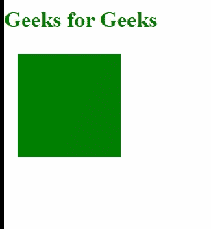
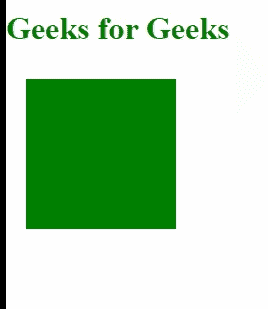

# D3 . js easepolout 功能

> 原文:[https://www.geeksforgeeks.org/d3-js-easepolyout-function/](https://www.geeksforgeeks.org/d3-js-easepolyout-function/)

**d3.js** 中的**D3 . easepoliout()**功能用于对特定元素的反向指数缓和过渡效果。如果没有指定指数，那么它默认为 3。

**方法:****D3 . js**过渡函数将用于对特定元素应用不同的缓和效果。首先，创建一个 SVG 元素并将其附加到 HTML 页面的正文中，然后创建一个矩形或任何其他形状并将其附加到 SVG 中。设置所应用形状的一些属性，使其具有良好的颜色和大小，并应用 **d3 .过渡**功能，然后应用**缓和()**功能，并将 **d3 .缓和缓和缓和**作为参数来缓和该功能。

**语法:**

```
d3.easePolyOut 

```

或者

```
 d3.easePolyOut.exponent(t);

```

**参数:**该函数接受一个参数，如上所述，如下所述。

*   **t:** 是要升到指数幂的时间。

**返回值:**这个函数不返回任何东西。

下面是上面给出的函数的几个例子。

**例 1:**

## 超文本标记语言

```
<!DOCTYPE html>
<html lang="en">

<head>
    <meta charset="UTF-8">
    <meta name="viewport" content="
        width=device-width, initial-scale=1.0">

    <script type="text/javascript" 
        src="https://d3js.org/d3.v4.min.js">
    </script>
</head>

<body>
    <h1 style="color:green">Geeks for Geeks</h1>
    <svg width="500px" height="500px"></svg>

    <script>
        var svg = d3.select("svg")
            .attr("transform", "translate(0, -50)");
        svg.append("rect")
            .attr("x", 20)
            .attr("y", 60)
            .attr("width", 150)
            .attr("height", 150)
            .attr("fill", "green")
            .transition()
            .ease(d3.easePolyOut)
            // .delay(6000)
            .attr("x", 100)
            .attr("y", 100)
            .attr("width", 10)
            .attr("height", 10)
            .duration(2000);
    </script>
</body>

</html>
```

**输出:**



**例 2:**

## 超文本标记语言

```
<!DOCTYPE html>
<html lang="en">

<head>
    <meta charset="UTF-8">
    <meta name="viewport" content="
  width=device-width, initial-scale=1.0">
</head>
<script type="text/javascript" src=
    "https://d3js.org/d3.v4.min.js">
</script>

<body>
    <h1 style="color:green"> Geeks for Geeks</h1>
    <svg width="500px" height="500px"></svg>

    <script>
        var svg = d3.select("svg")
            .attr("transform", "translate(0, -50)");
        svg.append("rect")
            .attr("x", 20)
            .attr("y", 60)
            .attr("width", 150)
            .attr("height", 150)
            .attr("fill", "green")
            .transition()
            .ease(d3.easePolyOut.exponent(.1))
            // .delay(6000)
            .attr("x", 100)
            .attr("y", 100)
            .attr("width", 10)
            .attr("height", 10)
            .duration(2000);
    </script>
</body>

</html>
```

**输出:**

