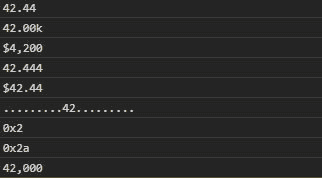

# D3.js 格式()功能

> 原文:[https://www.geeksforgeeks.org/d3-js-format-function/](https://www.geeksforgeeks.org/d3-js-format-function/)

D3.js 中的 **format()** 功能用于设置 D3 中可用的不同样式的数字的格式。它是 locale.format 的别名。

**语法:**

```
d3.format(specifier)(value);
```

**参数:**取上面给定，下面描述的参数。

*   **说明符:**指定格式类型。
*   **值:**是需要格式化的数字。

**返回值:**返回数字。

下面给出了上述函数的几个例子。

**示例 1:**

```
<!DOCTYPE html>
<html lang="en">
<head>
  <meta charset="UTF-8">
  <meta name="viewport"
        content="width=device-width,
                 initial-scale=1.0">
  <title>Document</title>
</head>
<style>
</style>
<body>
  <!--Fetching from CDN of D3.js -->
  <script type = "text/javascript" 
          src = "https://d3js.org/d3.v4.min.js">
   </script>
  <script>
    // It gives the floating point up to two decimals
    console.log(d3.format(".2f")(42.444))
    // It sets the SI-Prefix with two significant digits
    console.log(d3.format(".4s")(42000))
    // Currency sign i.e $
    console.log(d3.format("$, ")(4200))
    /* Left and right side of the number is
        filled with dots and centered.*/
    console.log(d3.format("^, ")(42.444))
    // Localised fixed-point currency
    console.log(d3.format("($.2f")(42.444))
    console.log(d3.format(".^20")(42))
    // Prefixed lowercase hexadecimal number
    console.log(d3.format("#x")(2))
    // Prefixed lowercase hexadecimal number
    console.log(d3.format("#x")(42))
    /* Number is grouped thousand with 
      two significant digits*/
    console.log(d3.format(", .2r")(42124))
 </script>
</body>
</html>
```

**输出:**

