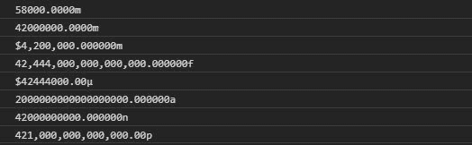
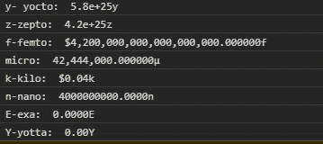

# D3.js formatPrefix()函数

> 原文:[https://www.geeksforgeeks.org/d3-js-formatprefix-function/](https://www.geeksforgeeks.org/d3-js-formatprefix-function/)

D3.js 中的 **formatPrefix()** 函数用于将值转换为适当 SI 前缀的单位，如微微、毫微微、毫微微等。对于给定的数字。

**语法:**

```
d3.formatPrefix(specifier, value);
```

**参数:**取上面给定的和下面描述的两个参数。

*   **说明符:**是告知格式样式的说明符。
*   **值:**是用定点记数法格式化前指定的数值参考值。

**返回值:**这个方法返回一个函数。

下面给出了几个 formatPrefix()函数的例子。

**例 1:**

```
<!DOCTYPE html>
<html lang="en">
<head>
  <meta charset="UTF-8">
  <meta name="viewport" 
        content="width=device-width, 
                 initial-scale=1.0">
  <title>Document</title>
</head>
<style>
</style>
<body>
  <!--Fetching from CDN of D3.js -->
  <script type = "text/javascript" 
          src = "https://d3js.org/d3.v4.min.js">
  </script>
  <script>
    // It is the Floating point up to two decimals
    // value is 1e-1
    console.log(d3.formatPrefix(".4s", 1e-1)(58))
    // It sets the SI-Prefix with two significant digits
    // value is 1e-2
    console.log(d3.formatPrefix(".4s", 1e-2)(42000))
    // Currency sign i.e $
    // value is 1e-3
    console.log(d3.formatPrefix("$, ", 1e-3)(4200))
    // Filled with dots and centered in between them
    // value is 1e-4
    console.log(d3.formatPrefix("^, ", 1e-14)(42.444))
    // Localised fixed-point currency
    // value is 1e-5
    console.log(d3.formatPrefix("($.2f", 1e-5)(42.444))
    // value is 1e-8
    console.log(d3.formatPrefix("#", 1e-18)(2))
    // value is 1e-9
    console.log(d3.formatPrefix("#s", 1e-9)(42))
    // Number is grouped thousand with two significant digits
    // value is 1e-12
    console.log(d3.formatPrefix(", .2r", 1e-12)(421))
 </script>
</body>
</html>
```

**输出:**



**例 2:**

```
<!DOCTYPE html>
<html lang="en">
<head>
  <meta charset="UTF-8">
  <meta name="viewport"
        content="width=device-width, 
                 initial-scale=1.0">
  <title>Document</title>
</head>
<style>
</style>
<body>
  <!--Fetching from CDN of D3.js -->
  <script type = "text/javascript" 
          src = "https://d3js.org/d3.v4.min.js">
  </script>
  <script>
    // It is the Floating point up to two decimals
    // value is 1e-24
    console.log(
"y- yocto: ", d3.formatPrefix(".4s", 1e-24)(58))
    // It sets the SI-Prefix with two significant digits
    // value is 1e-21
    console.log(
"z-zepto: ", d3.formatPrefix(".4s", 1e-21)(42000))
    // Currency sign i.e $
    // value is 1e-15
    console.log(
"f-femto: ", d3.formatPrefix("$, ", 1e-15)(4200))
    // value is 1e-6
    console.log(
"micro: ", d3.formatPrefix("^, ", 1e-6)(42.444))
    // value is 1e+3
    console.log(
"k-kilo: ", d3.formatPrefix("($.2f", 1e+3)(42.444))
    // value is 1e-9
    console.log(
"n-nano: ", d3.formatPrefix(".4s", 1e-9)(4))
    // value is 1e+18
    console.log(
"E-exa: ", d3.formatPrefix(".4s", 1e+18)(424))
    // value is 1e+24
    console.log(
"Y-yotta: ", d3.formatPrefix(".2f", 1e+24)(0))
 </script>
</body>
</html>
```

**输出:**

