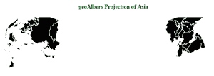
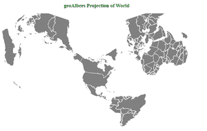

# D3.js geoAlbers()函数

> 原文:[https://www.geeksforgeeks.org/d3-js-geoalbers-function/](https://www.geeksforgeeks.org/d3-js-geoalbers-function/)

**d3.js** 中的 **geoAlbers()** 功能用于绘制**艾伯斯等面积圆锥投影**。阿尔伯斯投影以海因里希·c·艾伯斯的名字命名，是一种圆锥形的等面积地图投影，使用两条标准平行线。不保留刻度和形状，标准纬线之间的扭曲最小。它从 geojson 数据中绘制一个 **geoAlbers 投影**。

**语法:**

```
 d3.geoAlbers()

```

**参数:**此方法不接受任何参数。

**返回值**该方法返回可视化的艾伯斯等面积圆锥投影。

**例 1:** 下例对亚洲大陆进行投影。

## 超文本标记语言

```
<!DOCTYPE html> 
<html lang="en"> 

<head> 
    <meta charset="UTF-8" /> 
    <meta name="viewport"
        content="width=device-width, 
                initial-scale=1.0"/>     
</head> 

<body> 
    <div style="width:700px; height:700px;"> 
        <center>      

            <h4 style="color:green" font ='bold'> 
            geoAlbers Projection of Asia
            </h4>   
        </center>

        <svg width="700" height="500"> 
        </svg> 
    </div> 
    <script src="https://d3js.org/d3.v4.js">
    </script>
    <script src="
    https://d3js.org/d3-geo-projection.v2.min.js">
   </script>
    <script>

    var svg = d3.select("svg"),
    width = +svg.attr("width"),
    height = +svg.attr("height");

   // geoAlbers projection
   var gfg = d3.geoAlbers()
    .scale(width / 1.5 / Math.PI)
    .translate([width / 2, height / 2])

   // Loading the json data
   d3.json("https://raw.githubusercontent.com/
   janasayantan/datageojson/master/geoasia.json", 
    function(data){

    // Draw the map
    svg.append("g")
         .selectAll("path")
         .data(data.features)
         .enter().append("path")
         .attr("fill", "black")
         .attr("d", d3.geoPath()
          .projection(gfg)
          )
      .style("stroke", "#ffff")
})

</script>
</body> 

</html>
```

**输出:**



**示例 2:** 以下示例显示了世界的投影。

## 超文本标记语言

```
<!DOCTYPE html> 
<html lang="en"> 

<head> 
    <meta charset="UTF-8" /> 
    <meta name="viewport"
        content="width=device-width, 
                initial-scale=1.0"/> 
</head> 

<body> 
    <div style="width:700px; height:700px;"> 
        <center>      

            <h3 style="color:green" font ='bold'> 
            geoAlbers Projection of World
            </h3>

        </center>        
        <svg width="700" height="500"> 
        </svg> 
    </div> 
    <script src="https://d3js.org/d3.v4.js">
    </script>
    <script src="https://d3js.org/
    d3-geo-projection.v2.min.js">
    </script>
    <script>

    var svg = d3.select("svg"),
    width = +svg.attr("width"),
    height = +svg.attr("height");

    // geoAlbers projection
    var gfg = d3.geoAlbers()
    .scale(width / 1.5 / Math.PI)
    .translate([width / 2, height / 2])

    // Loading the json data
    d3.json("https://raw.githubusercontent.com/
    janasayantan/datageojson/master/geoworld%20.json",
    function(data)
   {
    // Draw the map
    svg.append("g")
        .selectAll("path")
        .data(data.features)
        .enter().append("path")
            .attr("fill", "grey")
            .attr("d", d3.geoPath()
            .projection(gfg)
            )
        .style("stroke", "#ffff")
   })

</script>
</body>
</html>
```

**输出:**

