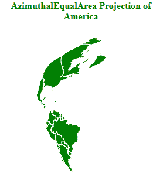
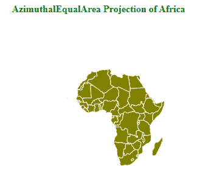

# D3.js geoAzimuthalEqualArea()函数

> 原文:[https://www . geeksforgeeks . org/D3-js-geoazimuthalequalarea-function/](https://www.geeksforgeeks.org/d3-js-geoazimuthalequalarea-function/)

**d3.js** 中的 **geoAzimuthalEqualArea** ()函数用于根据给定的 geojson 数据绘制**兰伯特方位角等面积投影**。它是一种投影，试图保持土地特征的正确相对大小，同时也保持从中心的正确方向感。这里的世界是从地球上的任何一点投射到一个平面上的。

**语法:**

```
d3.geoAzimuthalEqualArea()
```

**参数:**此方法不接受任何参数。

**返回值:**该方法返回方位等面积投影。

**示例 1:** 以下示例绘制了北美和南美的兰伯特方位角等面积投影。

## 超文本标记语言

```
<!DOCTYPE html>
<html>

<head>
    <script src="https://d3js.org/d3.v4.js">
    </script>
    <script src=
"https://d3js.org/d3-geo-projection.v2.min.js">
    </script>
</head>

<body>
    <div style="width:300px; 
              height:700px;">
        <center>
            <h4 style="color:green">
                AzimuthalEqualArea Projection
                of America
            </h4>
        </center>
        <svg width="400" height="300">
        </svg>
    </div>
    <script>
        var svg = d3.select("svg"),
            width = +svg.attr("width"),
            height = +svg.attr("height");

        // AzimuthalEqualArea projection
        var gfg = d3.geoAzimuthalEqualArea()
            .scale(width / 1.5 / Math.PI)
            .translate([width / 2, height / 2]);

        // Loading the json data 
        d3.json("https://raw.githubusercontent.com/" +
            "janasayantan/datageojson/master/" +
            "america.json",
            function (data) {

                // Draw the map
                svg.append("g")
                    .selectAll("path")
                    .data(data.features)
                    .enter().append("path")
                    .attr("fill", "green")
                    .attr("d", d3.geoPath()
                        .projection(gfg)
                    )
                    .style("stroke", "#ffff")
            });
    </script>
</body>

</html>
```

**输出:**



**示例 2:** 以下示例绘制了非洲的 Lambert 方位角等面积投影。

## 超文本标记语言

```
<!DOCTYPE html>
<html>

<head>
    <script src="https://d3js.org/d3.v4.js">
    </script>
    <script src=
"https://d3js.org/d3-geo-projection.v2.min.js">
    </script>
</head>

<body>
    <div style="width:600px;
              height:300px;">
        <center>
            <h4 style="color:green">
                AzimuthalEqualArea Projection
                of Africa
            </h4>
        </center>
        <svg width="600" height="300">
        </svg>
    </div>
    <script>
        var svg = d3.select("svg"),
            width = +svg.attr("width"),
            height = +svg.attr("height");

        // AzimuthalEqualArea
        var gfg = d3.geoAzimuthalEqualArea()
            .scale(width / 1.5 / Math.PI)
            .translate([width / 2, height / 2]);

        // Loading the json data 
        d3.json("https://raw.githubusercontent.com/" +
            "janasayantan/datageojson/master/" +
            "geoAfrica.json",
            function (data) {

                // Draw the map
                svg.append("g")
                    .selectAll("path")
                    .data(data.features)
                    .enter().append("path")
                    .attr("fill", "olive")
                    .attr("d", d3.geoPath()
                        .projection(gfg)
                    )
                    .style("stroke", "#ffff")
            });
    </script>
</body>

</html>
```

**输出:**

