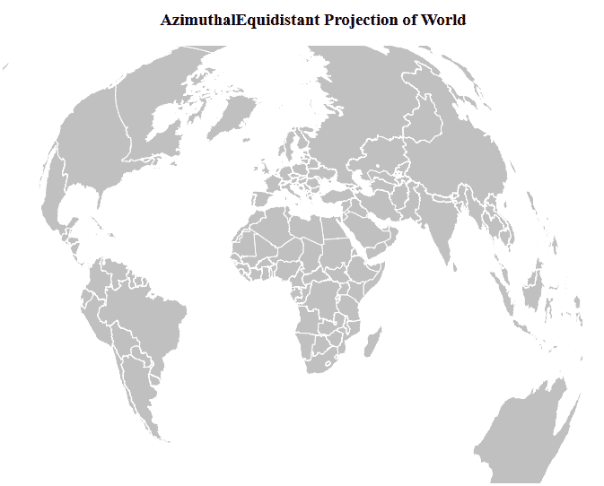
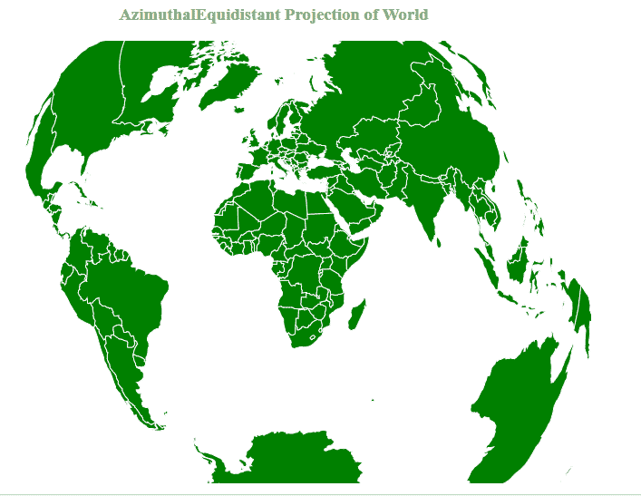

# D3 . jsgeoazimuthal 等距()函数

> 原文:[https://www . geeksforgeeks . org/D3-js-geoazimuthal 等距-function/](https://www.geeksforgeeks.org/d3-js-geoazimuthalequidistant-function/)

**d3.js** 中的**方位角等距**()功能用于从给定的 geojson 数据绘制**方位角等距投影**。这是一种地图投影，其中地图上的所有点与中心点的距离成比例地正确。此外，地图上的所有点都在从中心点开始的正确方向上。

**语法:**

```
d3.geoAzimuthalEquidistant()
```

**参数:**此方法不接受任何参数。

**返回值:**该方法返回方位角等距投影。

**示例 1:** 以下示例绘制了以(0，0)为中心的世界的方位角等距投影。

## 超文本标记语言

```
<html>

<head>
    <script src="https://d3js.org/d3.v4.js">
    </script>
    <script src=
"https://d3js.org/d3-geo-projection.v2.min.js">
    </script>
</head>

<body>
    <div style="width:800px; 
              height:600px;">
        <center>
            <h3 style="color:black">
                AzimuthalEquidistant Projection
                of World
            </h3>
        </center>
        <svg width="700" height="550">
        </svg>
    </div>
    <script>
        var svg = d3.select("svg"),
            width = +svg.attr("width"),
            height = +svg.attr("height");

        // AzimuthalEquidistant projection
        var gfg = d3.geoAzimuthalEquidistant()
            .scale(width / 1.5 / Math.PI)
            .translate([width / 2, height / 2]);

        // Loading the geojson data
        d3.json("https://raw.githubusercontent.com/" +
            "janasayantan/datageojson/master/" +
            "geoworld%20.json",
            function (data) {

                // Draw the map
                svg.append("g")
                    .selectAll("path")
                    .data(data.features)
                    .enter().append("path")
                    .attr("fill", "Silver")
                    .attr("d", d3.geoPath()
                        .projection(gfg)
                    )
                    .style("stroke", "#ffff")
            });
    </script>
</body>

</html>
```

**输出:**



**示例 2:** 以下示例使方位角等距投影以(-10，0)为中心，并相对于 x 轴逆时针旋转 10 度。

## 超文本标记语言

```
<!DOCTYPE html>
<html>

<head>
    <script src="https://d3js.org/d3.v4.js">
    </script>
    <script src=
"https://d3js.org/d3-geo-projection.v2.min.js">
    </script>
</head>

<body>
    <div style="width:700px; 
              height:600px;">
        <center>
            <h3 style="color:grey">
                AzimuthalEquidistant Projection
                of World
            </h3>
        </center>
        <svg width="700" height="550">
        </svg>
    </div>
    <script>
        var svg = d3.select("svg"),
            width = +svg.attr("width"),
            height = +svg.attr("height");

        // AzimuthalEquidistant  projection
        // Center(0,-10) and roating -10 degree
        var gfg = d3.geoAzimuthalEquidistant()
            .scale(width / 1.5 / Math.PI)
            .rotate([-10, 0])
            .center([0, -10])
            .translate([width / 2, height / 2]);

        // Loading the geojson data
        d3.json("https://raw.githubusercontent.com/" +
            "janasayantan/datageojson/master/" +
            "world.json",
            function (data) {

                // Draw the map
                svg.append("g")
                    .selectAll("path")
                    .data(data.features)
                    .enter().append("path")
                    .attr("fill", "green")
                    .attr("d", d3.geoPath()
                        .projection(gfg)
                    )
                    .style("stroke", "#ffff")
            });
    </script>
</body>

</html>
```

**输出:**

