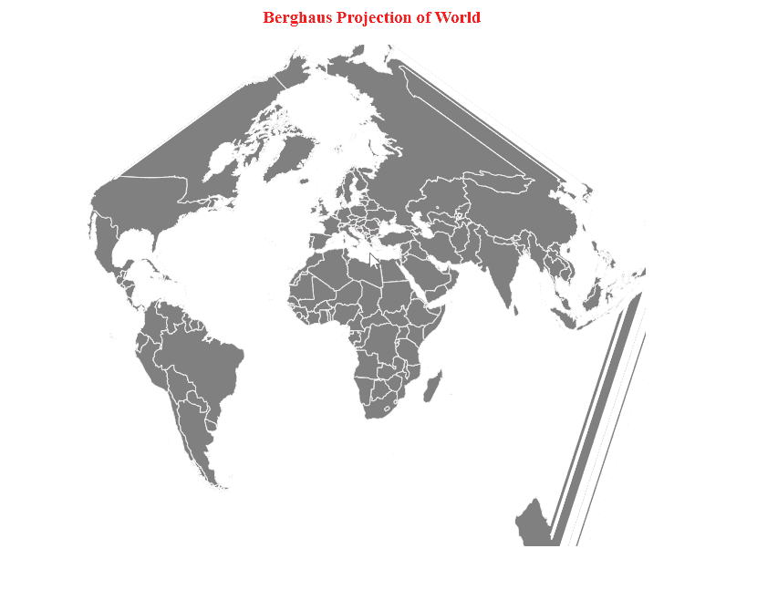

# D3.js geoBerghaus()函数

> 原文:[https://www.geeksforgeeks.org/d3-js-geoberghaus-function/](https://www.geeksforgeeks.org/d3-js-geoberghaus-function/)

**d3.js** 中的 **geoBerghaus()** 函数用于从给定的 geojson 数据中绘制 **Berghaus Dinomic 投影**。这是一个不共形或面积不等的星形方位角世界地图投影。所用星形的缺省波瓣数为 **5** ，如有需要可更改。

**语法:**

```
d3.geoBerghaus()

```

**参数:**此方法不接受任何参数。

**返回**:该方法返回伯格豪斯投影。

**例:**下面的例子做了世界的伯格豪斯投影。

## 超文本标记语言

```
<!DOCTYPE html>
<html>

<head>
    <script src="https://d3js.org/d3.v4.js">
    </script>
    <script src=
"https://d3js.org/d3-geo-projection.v2.min.js">
    </script>
</head>

<body>
    <div style="width:800px; height:600px;">
        <center>
            <h3 style="color:red">
                Berghaus Projection of World
            </h3>
        </center>
        <svg width="700" height="550">
        </svg>
    </div>
    <script>
        var svg = d3.select("svg"),
            width = +svg.attr("width"),
            height = +svg.attr("height");

        // Berghaus projection
        var gfg = d3.geoBerghaus()
            .scale(width / 1.5 / Math.PI)
            .translate([width / 2, height / 2])

        // Loading the geojson data
        d3.json("https://raw.githubusercontent.com/" +
            "janasayantan/datageojson/master/" +
            "geoworld%20.json",
            function (data) {

                // Draw the map
                svg.append("g")
                    .selectAll("path")
                    .data(data.features)
                    .enter().append("path")
                    .attr("fill", "grey")
                    .attr("d", d3.geoPath()
                        .projection(gfg)
                    )
                    .style("stroke", "#ffff")
            });
    </script>
</body>

</html>
```

**输出:**

