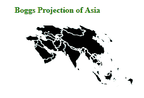

# D3 . js geobogs()函数

> 原文:[https://www.geeksforgeeks.org/d3-js-geoboggs-function/](https://www.geeksforgeeks.org/d3-js-geoboggs-function/)

d3.js 中的**geoBoggs()**函数用于绘制 bogs 的同形投影。博格正形投影是一种用于世界地图的伪圆柱形等面积地图投影。它根据给定的 geo JSON 数据进行博格正态投影。

**语法:**

```
d3.geoBoggs()
```

**参数:**此方法不接受任何参数。

**返回值:**此方法返回博格投影。

**例:**下面的例子做了亚洲的博格斯投影。

## 超文本标记语言

```
<!DOCTYPE html>
<html lang="en">

<head>
    <meta charset="UTF-8" />
    <meta name="viewport" content=
        "width=device-width, initial-scale=1.0" />

    <script src="https://d3js.org/d3.v4.js"></script>

    <script src=
"https://d3js.org/d3-geo-projection.v2.min.js">
    </script>
</head>

<body>
    <div style="width:700px; height:500px;">
        <center>
            <h4 style="color:green">
                Boggs Projection of Asia
            </h4>
        </center>

        <svg width="500" height="200">
        </svg>
    </div>

    <script>
        var svg = d3.select("svg"),
            width = +svg.attr("width"),
            height = +svg.attr("height");

        // Boggs projection
        var gfg = d3.geoBoggs()
            .scale(width / 1.5 / Math.PI)
            .translate([width / 2, height / 2])

        // Loading the json data 
        d3.json(
            "https://raw.githubusercontent.com/"
            + "janasayantan/datageojson/master/"
            + "geoasia.json",
            function (data) {
                // Draw the map
                svg.append("g")
                    .selectAll("path")
                    .data(data.features)
                    .enter().append("path")
                    .attr("fill", "black")
                    .attr("d", d3.geoPath()
                        .projection(gfg)
                    )
                    .style("stroke", "#ffff")
            })
    </script>
</body>

</html>
```

**输出:**

