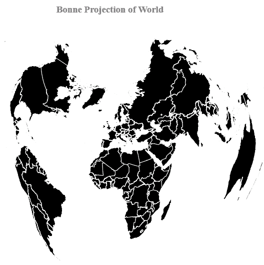

# D3.js geoBonne()功能

> 原文:[https://www.geeksforgeeks.org/d3-js-geobonne-function/](https://www.geeksforgeeks.org/d3-js-geobonne-function/)

d3.js 中的 **geoBonne()函数**用于绘制 Bonne 伪球面等面积投影。邦尼投影保持了沿中央子午线和标准平行线区域的精确形状，但逐渐远离这些区域扭曲。它根据给定的 geo JSON 数据进行 Bonne 投影。

**语法:**

```
d3.geoBonne()

```

**参数:**此方法不接受任何参数。

**返回值:**该方法返回 Bonne 伪圆锥等面积投影。

**示例:**下面的示例制作了世界的 Bonne 伪圆锥等面积投影。

## 超文本标记语言

```
<!DOCTYPE html> 
<html lang="en"> 

<head> 
    <meta charset="UTF-8" /> 
    <meta name="viewport"
        content="width=device-width, 
                initial-scale=1.0"/>   
    <script src=
        "https://d3js.org/d3.v4.js">
    </script>

    <script src=
        "https://d3js.org/d3-geo-projection.v2.min.js">
    </script>  
</head> 

<body> 
    <div style="width:700px; height:600px;"> 
        <center> 
            <h3 style="color:grey"> 
                Bonne Projection of World
            </h3>  
        </center>

        <svg width="700" height="550"> 
        </svg> 
    </div> 

    <script>
        var svg = d3.select("svg"),
            width = +svg.attr("width"),
            height = +svg.attr("height");

        // Bonne projection
        var gfg = d3.geoBonne()
            .scale(width / 1.5 / Math.PI)
            .translate([width / 2, height / 2])

        // Loading the json data
        d3.json("https://raw.githubusercontent.com/"
            + "janasayantan/datageojson/master/"
            + "geoworld%20.json", 
            function(data){
                // Draw the map
                svg.append("g")
                    .selectAll("path")
                    .data(data.features)
                    .enter().append("path")
                    .attr("fill", "black")
                    .attr("d", d3.geoPath()
                        .projection(gfg)
                    )
                    .style("stroke", "#ffff")
        })
    </script>
</body> 

</html>
```

**输出:**

