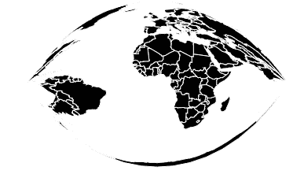
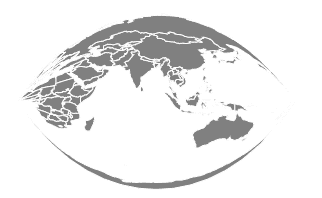

# D3 . js geograig()功能

> 原文:[https://www.geeksforgeeks.org/d3-js-geocraig-function/](https://www.geeksforgeeks.org/d3-js-geocraig-function/)

**d3.js** 中的**geograig(**)功能用于从给定的 geojson 数据绘制 **Craig 后向投影**。

**语法**:

```
d3.geoCraig()

```

**参数:**此方法不接受任何参数。

**返回值:**该方法返回克雷格投影。

**示例 1:** 以下示例绘制了世界的克雷格投影，中心位于(0，0)，旋转为 0。

## 超文本标记语言

```
<!DOCTYPE html>
<html>

<head>
    <script src="https://d3js.org/d3.v4.js">
    </script>
    <script src=
"https://d3js.org/d3-geo-projection.v2.min.js">
    </script>
</head>

<body>
    <div style="width:700px; height:500px;">
        <center>
            <h3 style="color:black"></h3>
        </center>
        <svg width="600" height="450">
        </svg>
    </div>

    <script>
        var svg = d3.select("svg"),
            width = +svg.attr("width"),
            height = +svg.attr("height");

        // Craig projection
        // Center at (0,0) with 0 degree rotation
        var gfg = d3.geoCraig()
            .scale(width / 1.8 / Math.PI)
            .rotate([0, 0])
            .center([0, 0])
            .translate([width / 2, height / 2]);

        // Loading the json data
        d3.json("https://raw.githubusercontent.com/" +
            "janasayantan/datageojson/master/" +
            "world.json",
            function (data) {

                // Drawing the map
                svg.append("g")
                    .selectAll("path")
                    .data(data.features)
                    .enter().append("path")
                    .attr("fill", "Black")
                    .attr("d", d3.geoPath()
                        .projection(gfg)
                    )
                    .style("stroke", "#ffff")
            });
    </script>
</body>

</html>
```

**输出:**



**示例 2:** 以下示例绘制了以(20，20)为中心，相对于 y 轴旋转-90 度的世界克雷格投影。

## 超文本标记语言

```
<!DOCTYPE html>
<html>

<head>
    <script src="https://d3js.org/d3.v4.js">
    </script>
    <script src=
"https://d3js.org/d3-geo-projection.v2.min.js">
    </script>
</head>

<body>
    <div style="width:700px; height:600px;">
        <center>
            <h3 style="color:black"></h3>
        </center>
        <svg width="500" height="450">
        </svg>
    </div>

    <script>
        var svg = d3.select("svg"),
            width = +svg.attr("width"),
            height = +svg.attr("height");

        // Craig  projection
        // Center at (20, 20) and 
        // -90 degree rotation w.r.t y-axis
        var gfg = d3.geoCraig()
            .scale(width / 1.8 / Math.PI)
            .rotate([-90, 0])
            .center([20, 20])
            .translate([width / 2, height / 2]);

        // Loading the json data
        d3.json("https://raw.githubusercontent.com/" +
            "janasayantan/datageojson/master/" +
            "world.json",
            function (data) {

                // Draw the map
                svg.append("g")
                    .selectAll("path")
                    .data(data.features)
                    .enter().append("path")
                    .attr("fill", "grey")
                    .attr("d", d3.geoPath()
                        .projection(gfg)
                    )
                    .style("stroke", "#ffff")
            });
    </script>
</body>

</html>
```

**输出:**

