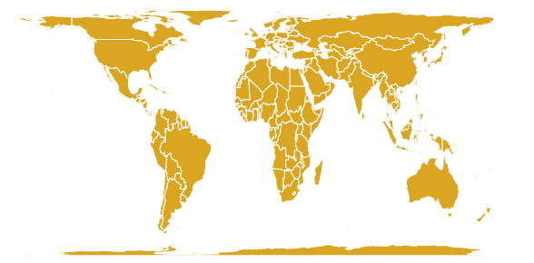
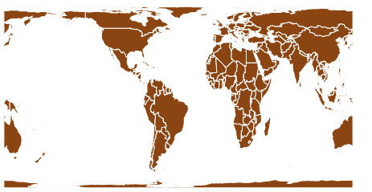

# D3 . js geoCylindricalEqualArea()功能

> 原文:[https://www . geeksforgeeks . org/D3-js-geocylindricalequalarea-function/](https://www.geeksforgeeks.org/d3-js-geocylindricalequalarea-function/)

D3.js 是一个 JavaScript 库，用于在 web 浏览器中产生动态的、交互式的数据可视化。它利用了可伸缩矢量图形、HTML5 和级联样式表标准。
D3 . js 中的 CylindricalEqualArea()函数用于绘制圆柱等面积投影。

**语法:**

```
d3.geoCylindricalEqualArea()
```

**参数:**此方法不接受任何参数。

**返回值:**该方法根据给定的 json 数据创建圆柱形等面积投影。

**示例 1:** 以下示例绘制世界的圆柱形等面积投影，中心位于(0，0)和 0°旋转。

```
<!DOCTYPE html>
<html lang="en">

<head>
    <meta charset="UTF-8" />
    <meta name="viewport" content="width=device-width, 
                initial-scale=1.0" />
</head>

<body>
    <div style="width: 700px; height: 500px;">
        <center>
            <h3 style="color: black;"></h3>
        </center>

        <svg width="600" height="450"></svg>
    </div>
    <script src="https://d3js.org/d3.v4.js"></script>
    <script src=
    "https://d3js.org/d3-geo-projection.v2.min.js">
    </script>
    <script>
        var svg = d3.select("svg"),
            width = +svg.attr("width"),
            height = +svg.attr("height");

        // CylindricalEqualArea projection
        // Center(0, 0) with 0 rotation
        var gfg = d3
            .geoCylindricalEqualArea()
            .scale(width / 1.8 / Math.PI)
            .rotate([0, 0])
            .center([0, 0])
            .translate([width / 2, height / 2]);

        // Loading the json data
        // Used json file stored at 
        /*https://raw.githubusercontent.com/janasayantan
                    /datageojson/master/world.json*/
        d3.json("https://raw.githubusercontent.com/"
            + "janasayantan/datageojson/master/world.json",
            function (data) {
                // Drawing the map
                svg.append("g").selectAll(
                    "path").data(data.features).enter().append(
                        "path").attr("fill", "GoldenRod").attr(
                            "d", d3.geoPath().projection(gfg)).style(
                                "stroke", "#ffff");
            });
    </script>
</body>

</html>
```

**输出:**



圆柱形世界的等面积投影，无旋转，以(0，0)为中心

**示例 2:** 以下示例在改变中心和旋转后绘制世界的圆柱形等面积投影。

```
<!DOCTYPE html>
<html lang="en">

<head>
    <meta charset="UTF-8" />
    <meta name="viewport" content="width=device-width, 
                initial-scale=1.0" />
</head>

<body>
    <div style="width: 700px; height: 600px;">
        <center>
            <h3 style="color: black;"></h3>
        </center>

        <svg width="500" height="450"></svg>
    </div>
    <script src="https://d3js.org/d3.v4.js"></script>
    <script src=
    "https://d3js.org/d3-geo-projection.v2.min.js">
    </script>
    <script>
        var svg = d3.select("svg"),
            width = +svg.attr("width"),
            height = +svg.attr("height");

        // CylindricalEqualArea  projection
        // Center(0, 20) and 45 degree rotation w.r.t Y axis
        var gfg = d3
            .geoCylindricalEqualArea()
            .scale(width / 1.8 / Math.PI)
            .rotate([45, 0])
            .center([0, 20])
            .translate([width / 2, height / 2]);

        // Loading the json data
        // Used json file stored at
        /*https://raw.githubusercontent.com/janasayantan
                    /datageojson/master/world.json*/
        d3.json("https://raw.githubusercontent.com/"
            + "janasayantan/datageojson/master/world.json",
            function (data) {
                // Draw the map
                svg.append("g").selectAll(
                    "path").data(data.features).enter().append(
                        "path").attr("fill", "SaddleBrown").attr(
                            "d", d3.geoPath().projection(gfg)).style(
                                "stroke", "#ffff");
            });
    </script>
</body>

</html>
```

**输出:**



圆柱形等面积投影，相对于 Y 轴旋转 45 度，以(0，20)为中心