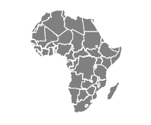
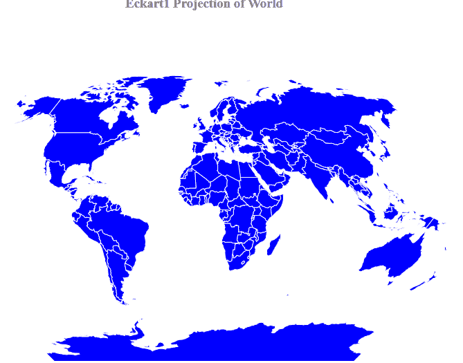

# D3.js geoEckert1()功能

> 原文:[https://www.geeksforgeeks.org/d3-js-geoeckert1-function/](https://www.geeksforgeeks.org/d3-js-geoeckert1-function/)

D3.js 是一个 JavaScript 库，用于在 web 浏览器中产生动态的、交互式的数据可视化。它利用了可伸缩矢量图形、HTML5 和级联样式表标准。

d3.js 中的 **geoEckert1()函数**用于绘制埃克特一世投影，这是一种折衷的伪圆柱地图投影，具有直线经线和奇怪的外观。这个投影是由马克斯·埃克特在 1906 年提出的。geoEckert1()函数根据给定的 geo JSON 数据进行 Eckert1 投影。

**语法:**

```
d3.geoEckert1()
```

**参数:**此方法不接受任何参数。

**返回值:**这个方法从 JSON 数据创建一个 Eckert1 投影。

**示例 1:** 以下示例制作了非洲大陆的 Eckert1 投影。

## 超文本标记语言

```
<!DOCTYPE html> 
<html lang="en"> 

<head> 
    <meta charset="UTF-8" /> 
    <meta name="viewport"
        content="width=device-width, 
                initial-scale=1.0"/> 
    <script src=
        "https://d3js.org/d3.v4.js">
    </script>

    <script src=
"https://d3js.org/d3-geo-projection.v2.min.js">
    </script>
</head> 

<body> 
    <div style="width:400px; height:300px;"> 
        <svg width="600" height="300"> 
        </svg> 
    </div> 

    <script>
        var svg = d3.select("svg"),
            width = +svg.attr("width"),
            height = +svg.attr("height");

        // creating Eckert1 projection
        var gfg = d3.geoEckert1()
            .scale(width / 1.5 / Math.PI)
            .translate([width / 2, height / 2])

        // Loading the json data 
        d3.json("https://raw.githubusercontent.com/"
        + "janasayantan/datageojson/master/geoAfrica.json", 
            function(data){
                // Draw the map
                svg.append("g")
                   .selectAll("path")
                   .data(data.features)
                   .enter().append("path")
                   .attr("fill", "grey")
                   .attr("d", d3.geoPath()
                       .projection(gfg)
                   ).style("stroke", "#ffff")
            })
    </script>
</body> 

</html>
```

**输出:**



**非洲 Ecart1 投影**

**例 2:** 下面的例子做了世界的 Eckert1 投影。

## 超文本标记语言

```
<!DOCTYPE html> 
<html lang="en"> 

<head> 
    <meta charset="UTF-8" /> 
    <meta name="viewport"
        content="width=device-width, 
                initial-scale=1.0"/> 
    <script src=    
        "https://d3js.org/d3.v4.js">
    </script>

    <script src=
"https://d3js.org/d3-geo-projection.v2.min.js">
    </script>
</head> 

<body> 
    <div style="width:700px; height:600px;"> 
        <center> 
            <h3 style="color:grey"> 
                Eckart1 Projection of World
            </h3>  
        </center>

        <svg width="700" height="550"> 
        </svg> 
    </div> 

    <script>
        var svg = d3.select("svg"),
            width = +svg.attr("width"),
            height = +svg.attr("height");

        // Eckart1  projection
        var gfg = d3.geoEckert1()
            .scale(width / 1.5 / Math.PI)
            .translate([width / 2, height / 2])

        // Loading the json data
        d3.json("https://raw.githubusercontent.com/"
        + "janasayantan/datageojson/master/world.json", 
            function(data){
                // Draw the map
                svg.append("g")
                   .selectAll("path")
                   .data(data.features)
                   .enter().append("path")
                   .attr("fill", "blue")
                   .attr("d", d3.geoPath()
                       .projection(gfg)
                   ).style("stroke", "#ffff")
            })
    </script>
</body> 

</html
```

**输出:**

