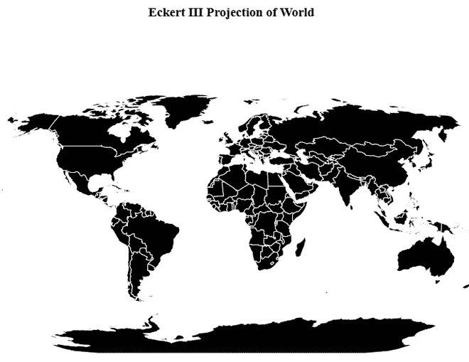
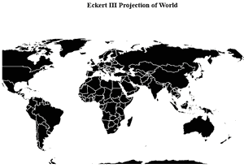

# D3.js geoEckert3()功能

> 原文:[https://www.geeksforgeeks.org/d3-js-geoeckert3-function/](https://www.geeksforgeeks.org/d3-js-geoeckert3-function/)

**D3.js** 是一个 JavaScript 库，用于在网络浏览器中产生动态的、交互式的数据可视化。它利用了可伸缩矢量图形、HTML5 和级联样式表标准。 **d3.js** 中的 **geoEckert3()** 函数用于绘制埃克特三世投影，这是一个既不共形也不等面积的伪圆柱投影。这个投影是由马克斯·埃克特在 1906 年提出的，主要用于世界地图。

**语法:**

```
d3.geoEckert3()

```

**参数:**此方法不接受任何参数。

**返回:**这个方法从给定的 JSON 数据创建一个 Eckert3 投影。

**示例 1:** 以下示例对中心位于(0，0)且无旋转的世界进行 Eckert3 投影。

## 超文本标记语言

```
<!DOCTYPE html>
<html lang="en">

<head>
    <meta charset="UTF-8" />
    <meta name="viewport" content="width=device-width, 
                initial-scale=1.0" />
    <script src="https://d3js.org/d3.v4.js"></script>
    <script src=
"https://d3js.org/d3-geo-projection.v2.min.js">
    </script>
</head>

<body>
    <div style="width:700px; height:600px;">
        <center>

            <h3 style="color:black">
                Eckert III Projection of World
            </h3>

        </center>

        <svg width="700" height="550">
        </svg>
    </div>

    <script>
        var svg = d3.select("svg"),
            width = +svg.attr("width"),
            height = +svg.attr("height");

        // geoEckert III  projection
        // Center(0, 0) and no rotation
        var gfg = d3.geoEckert3()
            .scale(width / 1.5 / Math.PI)
            .rotate([-10, 0])
            .center([0, -10])
            .translate([width / 2, height / 2])

        // Loading the json data
        // Used json file stored at 
        // https://raw.githubusercontent.com/janasayantan
        // datageojson/master/world.json
        d3.json("https://raw.githubusercontent.com/"
            + "janasayantan/datageojson/master/world.json",
            function(data) {
                // Draw the map
                svg.append("g")
                    .selectAll("path")
                    .data(data.features)
                    .enter().append("path")
                    .attr("fill", "black")
                    .attr("d", d3.geoPath()
                        .projection(gfg)
                    )
                    .style("stroke", "#ffff")
            })
    </script>
</body>

</html>
```

**输出:**



**示例 2:** 在下面的示例中，我们将进行以(20，20)为中心，相对于 y 轴逆时针旋转 30 度的世界的 Eckert3 投影。

## 超文本标记语言

```
<!DOCTYPE html>
<html lang="en">

<head>
    <meta charset="UTF-8" />
    <meta name="viewport" content="width=device-width, 
                initial-scale=1.0" />
    <script src="https://d3js.org/d3.v4.js"></script>
    <script src=
"https://d3js.org/d3-geo-projection.v2.min.js">
    </script>
</head>

<body>
    <div style="width:700px; height:600px;">
        <center>

            <h3 style="color:black">
                Eckert III Projection of World
            </h3>

        </center>

        <svg width="700" height="400">
        </svg>
    </div>

    <script>
        var svg = d3.select("svg"),
            width = +svg.attr("width"),
            height = +svg.attr("height");

        // geoEckert III  projection
        // Center(20, 20) and  rotating 30 
        // degree anti-clockwise
        var gfg = d3.geoEckert3()
            .scale(width / 1.5 / Math.PI)
            .rotate([-30, 0])
            .center([20, 20])
            .translate([width / 2, height / 2])

        // Loading the json data
        // Used json file stored at 
        // https://raw.githubusercontent.com/janasayantan
        // datageojson/master/world.json
        d3.json("https://raw.githubusercontent.com/"
            + "janasayantan/datageojson/master/world.json",
            function (data) {
                // Draw the map
                svg.append("g")
                    .selectAll("path")
                    .data(data.features)
                    .enter().append("path")
                    .attr("fill", "black")
                    .attr("d", d3.geoPath()
                        .projection(gfg)
                    )
                    .style("stroke", "#ffff")
            })
    </script>
</body>

</html>
```

**输出:**

