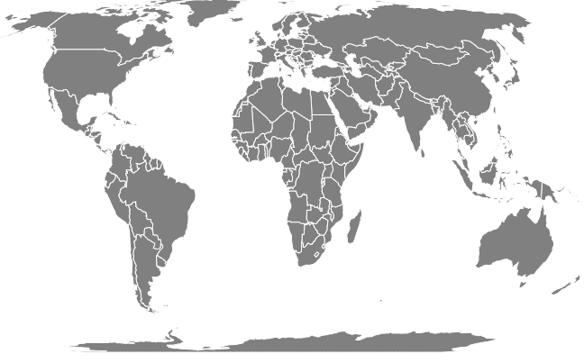
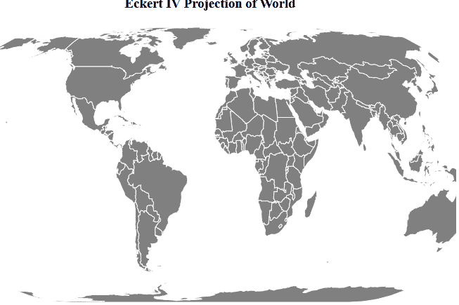

# D3.js geoEckert4()功能

> 原文:[https://www.geeksforgeeks.org/d3-js-geoeckert4-function/](https://www.geeksforgeeks.org/d3-js-geoeckert4-function/)

D3.js 是一个 JavaScript 库，用于在 web 浏览器中产生动态的、交互式的数据可视化。它利用了可伸缩矢量图形、HTML5 和级联样式表标准。

d3.js 中的 **geoEckert4()函数**用于绘制埃克特 IV 投影，该投影为等面积伪圆柱地图投影。极线的长度是赤道的一半，经度线是半椭圆或椭圆的一部分。

**语法:**

```
d3.geoEckert4()
```

**参数:**此方法不接受任何参数。

**返回值:**这个方法从给定的 JSON 数据创建一个 Eckert4 投影。

**示例 1:** 以下示例对世界进行 Eckert4 投影，中心在(0，0)，无旋转。

## 超文本标记语言

```
<!DOCTYPE html> 
<html lang="en"> 

<head> 
    <meta charset="UTF-8" /> 
    <meta name="viewport"
        content="width=device-width, 
                initial-scale=1.0"/>   
    <script src=
        "https://d3js.org/d3.v4.js">
    </script>
    <script src=
"https://d3js.org/d3-geo-projection.v2.min.js">
    </script>  
</head> 

<body> 
    <div style="width:700px; height:600px;"> 
        <svg width="700" height="550"> 
        </svg> 
    </div> 

    <script>
        var svg = d3.select("svg"),
            width = +svg.attr("width"),
            height = +svg.attr("height");

        // geoEckert Iv  projection
        // Center(0,0) and no rotation
        var gfg = d3.geoEckert4()
            .scale(width / 1.5 / Math.PI)
            .rotate([0,0])
            .center([0,0])
            .translate([width / 2, height / 2])

        // Loading the json data
        d3.json("https://raw.githubusercontent.com/"
            + "janasayantan/datageojson/master/world.json", 
            function(data){
                // Draw the map
                svg.append("g")
                   .selectAll("path")
                   .data(data.features)
                   .enter().append("path")
                   .attr("fill", "GREY")
                   .attr("d", d3.geoPath()
                       .projection(gfg)
                    ).style("stroke", "#ffff")
        })
    </script>
</body> 

</html>
```

**输出**:



**中心为(0，0)旋转为 0 的埃克特四投影**

**例 2:** 下例以(0，0)为中心，顺时针旋转 20 度，对世界进行 Eckert4 投影。

## 超文本标记语言

```
<!DOCTYPE html> 
<html lang="en"> 

<head> 
    <meta charset="UTF-8" /> 
    <meta name="viewport"
        content="width=device-width, 
                initial-scale=1.0"/>
    <script src=
        "https://d3js.org/d3.v4.js">
    </script>
    <script src=
"https://d3js.org/d3-geo-projection.v2.min.js">
    </script>
</head> 

<body> 
    <div style="width:700px; height:600px;"> 
        <center> 
            <h3 style="color:black"> 
            Eckert IV Projection of World
            </h3>  
        </center>
        <svg width="700" height="400"> 
        </svg> 
    </div> 

    <script>
        var svg = d3.select("svg"),
            width = +svg.attr("width"),
            height = +svg.attr("height");

        // geoEckert IV  projection
        // Center(0,0) and rotating 20 
        // degree clockwise
        var gfg = d3.geoEckert4()
            .scale(width / 1.5 / Math.PI)
            .rotate([20,0])
            .center([0,0])
            .translate([width / 2, height / 2])

        // Loading the json data
        d3.json("https://raw.githubusercontent.com/"
            + "janasayantan/datageojson/master/world.json", 
            function(data) {
                // Draw the map
                svg.append("g")
                   .selectAll("path")
                   .data(data.features)
                   .enter().append("path")
                   .attr("fill", "GREY")
                   .attr("d", d3.geoPath()
                       .projection(gfg)
                   ).style("stroke", "#ffff")
        })
    </script>
</body> 

</html>
```

**输出:**



**埃克特四世旋转投影**