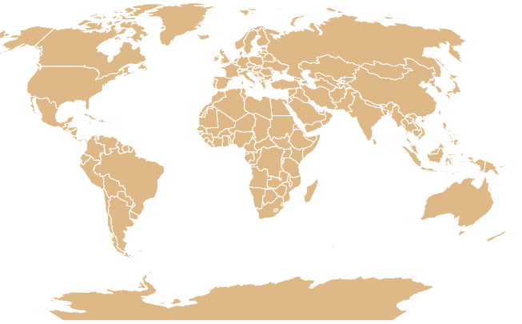
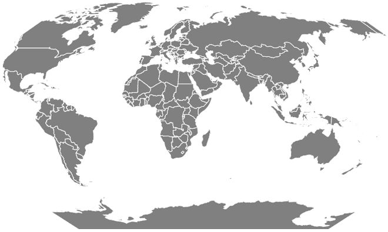

# D3.js geoEckert5()功能

> 原文:[https://www.geeksforgeeks.org/d3-js-geoeckert5-function/](https://www.geeksforgeeks.org/d3-js-geoeckert5-function/)

JavaScript **D3.js** 库有助于使用 HTML5、可缩放矢量图形和级联样式表为网页提供交互式数据可视化。 **d3.js** 中的 **geoEckert5()** 功能用于绘制**埃克特 V** 投影。

**语法:**

```
d3.geoEckert5()
```

**参数:**此方法不接受任何参数。

**返回值:**该方法根据给定的 JSON 数据创建一个 **Eckert5** 投影。

**示例 1:** 以下示例对中心位于(0，0)且无旋转的世界进行 **Eckert5** 投影。

```
<!DOCTYPE html>
    <html lang="en">

    <head>
        <meta charset="UTF-8" />
        <meta name="viewport" content="width = device-width, 
            initial-scale = 1.0" />

        <script src="https://d3js.org/d3.v4.js"></script>
        <script src=
    "https://d3js.org/d3-geo-projection.v2.min.js">
        </script>
    </head>

    <body>
        <div style="width:700px; height:600px;">
            <svg width="700" height="550">
            </svg>
        </div>

        <script>
            var svg = d3.select("svg"),
                width = +svg.attr("width"),
                height = +svg.attr("height");

            // geoEckert v  projection
            // Center(0, 0) and no rotation
            var gfg = d3.geoEckert5()
                .scale(width / 1.5 / Math.PI)
                .rotate([0, 0])
                .center([0, 0])
                .translate([width / 2, height / 2])

            // Loading the json data
            // Used json file stored at
            // https://raw.githubusercontent.com/janasayantan
            // datageojson/master/world.json
            d3.json("https://raw.githubusercontent.com/"
                + "janasayantan/datageojson/master/world.json",
                function (data) {
                    // Draw the map
                    svg.append("g")
                        .selectAll("path")
                        .data(data.features)
                        .enter().append("path")
                        .attr("fill", "BurlyWood")
                        .attr("d", d3.geoPath()
                            .projection(gfg)
                        )
                        .style("stroke", "# ffff")
                })
        </script>
    </body>

    </html>
```

**输出:**



**示例 2:** 在下面的示例中，我们将进行世界的**埃克特 5** 投影，中心位于(0，0)并相对于 Y 轴逆时针旋转 45 度。

## 超文本标记语言

```
<!DOCTYPE html>
<html lang="en">

<head>
    <meta charset="UTF-8" />
    <meta name="viewport" content=
        "width=device-width, 
        initial-scale=1.0" />
    <script src="https://d3js.org/d3.v4.js"></script>
    <script src=
"https://d3js.org/d3-geo-projection.v2.min.js">
    </script>
</head>

<body>
    <div style="width:700px; height:600px;">

        <svg width="700" height="400">
        </svg>
    </div>

    <script>
        var svg = d3.select("svg"),
            width = +svg.attr("width"),
            height = +svg.attr("height");

        // geoEckert IV  projection
        // Center(0, 0) and  rotating 45
        // degree anti-clockwise
        var gfg = d3.geoEckert5()
            .scale(width / 1.5 / Math.PI)
            .rotate([-45, 0])
            .center([0, 0])
            .translate([width / 2, height / 2])

        // Loading the json data
        // Used json file stored at 
        // https://raw.githubusercontent.com/janasayantan
        // datageojson/master/world.json
        d3.json("https://raw.githubusercontent.com/"
            + "janasayantan/datageojson/master/world.json",
            function (data) {
                // Draw the map
                svg.append("g")
                    .selectAll("path")
                    .data(data.features)
                    .enter().append("path")
                    .attr("fill", "GREY")
                    .attr("d", d3.geoPath()
                        .projection(gfg)
                    )
                    .style("stroke", "#ffff")
            })
    </script>
</body>

</html>
```

**输出:**

