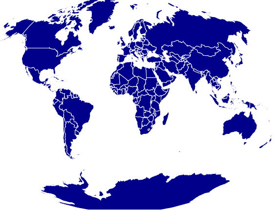
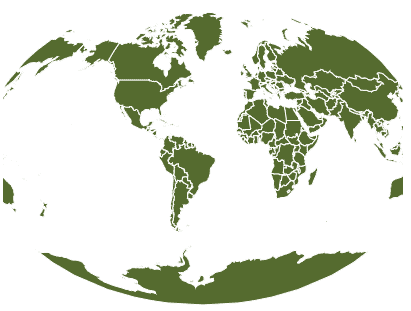

# D3.js geoFahey()函数

> 原文:[https://www.geeksforgeeks.org/d3-js-geofahey-function/](https://www.geeksforgeeks.org/d3-js-geofahey-function/)

D3.js 是一个 JavaScript 库，用于在 web 浏览器中产生动态的、交互式的数据可视化。它利用了可伸缩矢量图形、HTML5 和级联样式表标准。

d3.js 中的 **geoFahey** ()函数用于绘制法赫伪圆柱投影。

**语法:**

```
d3.geoFahey()
```

**参数:**此方法不接受任何参数。

**返回值:**该方法根据给定的 json 数据创建法赫伪圆柱投影。

**示例 1:** 以下示例对中心位于(0，0)且无旋转的世界进行 Eckert6 投影。

## 超文本标记语言

```
<!DOCTYPE html>
<html lang="en">

<head>
    <meta charset="UTF-8" />
    <meta name="viewport" content="width=device-width, 
                initial-scale=1.0" />

    <script src="https://d3js.org/d3.v4.js"></script>
    <script src=
"https://d3js.org/d3-geo-projection.v2.min.js">
    </script>
</head>

<body>
    <div style="width:700px; height:500px;">
        <svg width="600" height="450"></svg>
    </div>

    <script>
        var svg = d3.select("svg"),
            width = +svg.attr("width"),
            height = +svg.attr("height");

        // Fahey  projection
        // Center(0,0) with 0 rotation
        var gfg = d3.geoFahey()
            .scale(width / 1.5 / Math.PI)
            .rotate([0, 0])
            .center([0, 0])
            .translate([width / 2, height / 2])

        // Loading the json data
        // Used json file stored at 
        // https://raw.githubusercontent.com/janasayantan
        // /datageojson/master/world.json
        d3.json("https://raw.githubusercontent.com/"
            + "janasayantan/datageojson/master/world.json",
            function (data) {

                // Draw the map
                svg.append("g")
                    .selectAll("path")
                    .data(data.features)
                    .enter().append("path")
                    .attr("fill", "DarkBlue")
                    .attr("d", d3.geoPath()
                        .projection(gfg)
                    )
                    .style("stroke", "#ffff")
            })
    </script>
</body>

</html>
```

**输出:**



**法赫投影，无旋转，以(0，0)** 为中心

**示例 2:** 以下示例通过改变中心和旋转对世界进行法赫投影。

## 超文本标记语言

```
<!DOCTYPE html>
<html lang="en">

<head>
    <meta charset="UTF-8" />
    <meta name="viewport" content="width=device-width, 
                initial-scale=1.0" />

    <script src=
        "https://d3js.org/d3.v4.js">
    </script>
    <script src=
"https://d3js.org/d3-geo-projection.v2.min.js">
    </script>
</head>

<body>
    <div style="width:700px; height:900px;">
        <svg width="400" height="450"></svg>
    </div>

    <script>
        var svg = d3.select("svg"),
            width = +svg.attr("width"),
            height = +svg.attr("height");

        // Fahey  projection
        // Center(0,10) and 45 degree 
        // anticlock rotation
        var gfg = d3.geoFahey()
            .scale(width / 1.5 / Math.PI)
            .rotate([45, 0])
            .center([0, 10])
            .translate([width / 2, height / 2])

        // Loading the json data
        // Used json file stored at 
        // https://raw.githubusercontent.com/janasayantan
        // /datageojson/master/world.json
        d3.json("https://raw.githubusercontent.com/"
            + "janasayantan/datageojson/master/world.json",
            function (data) {

                // Draw the map
                svg.append("g")
                    .selectAll("path")
                    .data(data.features)
                    .enter().append("path")
                    .attr("fill", "DarkOliveGreen")
                    .attr("d", d3.geoPath()
                        .projection(gfg)
                    )
                    .style("stroke", "#ffff")
            })
    </script>
</body>

</html>
```

**输出:**



**法赫投影，逆时针旋转 45 度，中心位于(0，10)**