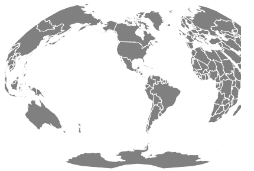

# D3.js geoGinzburg4()功能

> 原文:[https://www.geeksforgeeks.org/d3-js-geoginzburg4-function/](https://www.geeksforgeeks.org/d3-js-geoginzburg4-function/)

D3.js 是一个 JavaScript 库，用于在 web 浏览器中产生动态的、交互式的数据可视化。它利用了可伸缩矢量图形、HTML5 和级联样式表标准。
D3 . js 中的 geoGinzburg4()函数用于绘制*Ginzburg IV 投影*。

**语法:**

```
d3.geoGinzburg4()
```

**参数:**此方法不接受任何参数。

**返回值:**该方法根据给定的 json 数据创建 Ginzburg IV 投影。

**例 1:** 下例进行世界共形圆锥投影，中心在(0，0)处，无旋转。

```
<!DOCTYPE html>
<html lang="en">

<head>
    <meta charset="UTF-8" />
    <meta name="viewport" content=
        "width=device-width, initial-scale=1.0" />
    <script src="https://d3js.org/d3.v4.js"></script>
    <script src=
"https://d3js.org/d3-geo-projection.v2.min.js">
    </script>
</head>

<body>
    <div style="width:700px; height:500px;">
        <center>
            <h3 style="color:black">
            </h3>
        </center>

        <svg width="600" height="450">
        </svg>
    </div>

    <script>

        var svg = d3.select("svg"),
            width = +svg.attr("width"),
            height = +svg.attr("height");

        // Ginzburg4 projection
        // Center(0, 0) with 0 rotation
        var gfg = d3.geoGinzburg4()
            .scale(width / 1.5 / Math.PI)
            .rotate([0, 0])
            .center([0, 0])
            .translate([width / 2, height / 2])

        // Loading the json data
        // Used json file stored at:
        // https://raw.githubusercontent.com/janasayantan
        // /datageojson/master/world.json

        var myURL = "https://raw.githubusercontent.com/" +
            "janasayantan/datageojson/master/world.json"

        d3.json(myURL, function (data) {

            // Draw the map
            svg.append("g")
                .selectAll("path")
                .data(data.features)
                .enter().append("path")
                .attr("fill", "Sienna")
                .attr("d", d3.geoPath()
                    .projection(gfg)
                )
                .style("stroke", "#ffff")
        })
    </script>
</body>

</html>
```

**输出:**


**无旋转且以(0，0)** 为中心的金兹堡 IV 投影

**示例 2:** 以下示例在自定义中心和旋转后，对世界进行 Ginzburg IV 投影。

```
<!DOCTYPE html>
<html lang="en">

<head>
    <meta charset="UTF-8" />
    <meta name="viewport" content=
        "width=device-width, initial-scale=1.0" />
    <script src="https://d3js.org/d3.v4.js"></script>
    <script src=
"https://d3js.org/d3-geo-projection.v2.min.js">
    </script>
</head>

<body>
    <div style="width:600px; height:500px;">
        <center>
            <h3 style="color:black">
            </h3>
        </center>

        <svg width="400" height="550">
        </svg>
    </div>

    <script>
        var svg = d3.select("svg"),
            width = +svg.attr("width"),
            height = +svg.attr("height");

        // Ginzburg4  projection
        // Center(-20, 20) and 90 degree
        // rotation w.r.t X axis
        var gfg = d3.geoGinzburg4()
            .scale(width / 1.5 / Math.PI)
            .rotate([90, 0])
            .center([-20, 20])
            .translate([width / 2, height / 2])

        // Loading the json data
        // Used json file stored at:
        // https://raw.githubusercontent.com/janasayantan
        // /datageojson/master/world.json

        var myURL = "https://raw.githubusercontent.com/" +
            "janasayantan/datageojson/master/world.json"

        d3.json(myURL, function (data) {

            // Draw the map
            svg.append("g")
                .selectAll("path")
                .data(data.features)
                .enter().append("path")
                .attr("fill", "grey")
                .attr("d", d3.geoPath()
                    .projection(gfg)
                )
                .style("stroke", "#ffff")
        })
    </script>
</body>

</html>
```

**输出:**



**旋转 90 度的金兹伯格 4 投影，中心位于(-20，20)**