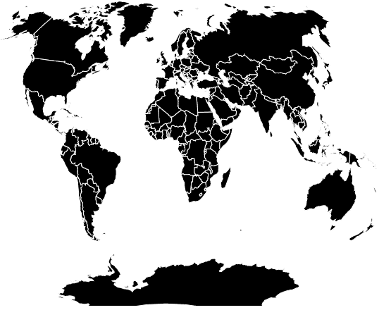
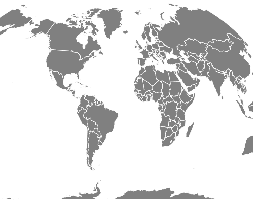

# D3.js geoGinzburg6()功能

> 原文:[https://www.geeksforgeeks.org/d3-js-geoginzburg6-function/](https://www.geeksforgeeks.org/d3-js-geoginzburg6-function/)

D3.js 是一个 JavaScript 库，用于在 web 浏览器中产生动态的、交互式的数据可视化。它利用了可伸缩矢量图形、HTML5 和级联样式表标准。

d3.js 中的 **geoGinzburg6()函数**用于绘制 Ginzburg VI 投影。

**语法:**

```
d3.geoGinzburg6()
```

**参数:**此方法不接受任何参数。

**返回值:**这个方法从给定的 JSON 数据创建并返回 Ginzburg6 投影。

**例 1:** 下例以(0，0)为中心，0°旋转，对世界进行 Ginzburg6 投影。

## 超文本标记语言

```
<!DOCTYPE html> 
<html lang="en"> 

<head> 
    <meta charset="UTF-8" /> 
    <meta name="viewport"
        content="width=device-width, 
                initial-scale=1.0"/> 

    <script src="https://d3js.org/d3.v4.js"></script>

    <script src=
"https://d3js.org/d3-geo-projection.v2.min.js">
    </script>
</head> 

<body> 
    <div style="width:700px; height:500px;"> 
        <svg width="600" height="450"> 
        </svg> 
    </div> 

    <script>
        var svg = d3.select("svg"),
            width = +svg.attr("width"),
            height = +svg.attr("height");

        // Ginzburg6 projection
        // Center(0,0) with 0 rotation
        var gfg = d3.geoGinzburg6()
            .scale(width / 1.5 / Math.PI)
            .rotate([0,0])
            .center([0,0])
            .translate([width / 2, height / 2]);

        // Loading the json data
        d3.json(
            "https://raw.githubusercontent.com/"
            +"janasayantan/datageojson/master/world.json", 
            function(data){
                // Draw the map
                svg.append("g")
                    .selectAll("path")
                    .data(data.features)
                    .enter().append("path")
                    .attr("fill", "Black")
                    .attr("d", d3.geoPath()
                        .projection(gfg)
                    )
                    .style("stroke", "#ffff")
            })
    </script>
</body> 

</html>
```

**输出:**



金兹伯格 6 世界投影，无旋转，以(0，0)为中心

**示例 2:** 以下示例在自定义中心和旋转后绘制了 Ginzburg6 的世界投影。

## 超文本标记语言

```
<!DOCTYPE html> 
<html lang="en"> 

<head> 
    <meta charset="UTF-8" /> 
    <meta name="viewport"
        content="width=device-width, 
                initial-scale=1.0"/> 

    <script src="https://d3js.org/d3.v4.js"></script>

    <script src=
"https://d3js.org/d3-geo-projection.v2.min.js">
    </script>
</head> 

<body> 
    <div style="width:500px; height:600px;"> 
        <svg width="500" height="450"> 
        </svg> 
    </div> 

    <script>
        var svg = d3.select("svg"),
            width = +svg.attr("width"),
            height = +svg.attr("height");

        // Ginzburg6  projection
        // Center(20,20) and 45 degree 
        // rotation w.r.t Y axis
        var gfg = d3.geoGinzburg6()
            .scale(width / 1.3 / Math.PI)
            .rotate([45,0])
            .center([20,20])
            .translate([width / 2, height / 2])

        // Loading the json data
        d3.json(
            "https://raw.githubusercontent.com/"
            +"janasayantan/datageojson/master/world.json", 
            function(data){
                // Draw the map
                svg.append("g")
                    .selectAll("path")
                    .data(data.features)
                    .enter().append("path")
                    .attr("fill", "grey")
                    .attr("d", d3.geoPath()
                        .projection(gfg)
                    )
                    .style("stroke", "#ffff")
        })
    </script>
</body> 

</html>
```

**输出:**



金兹伯格 6 投影，X 轴旋转 45 度，中心位于(20，20)