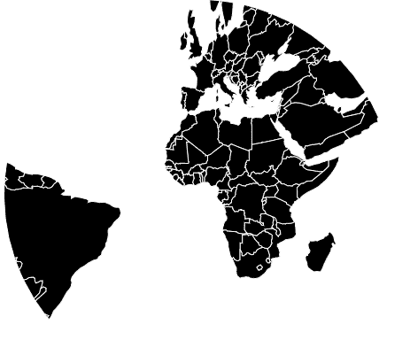
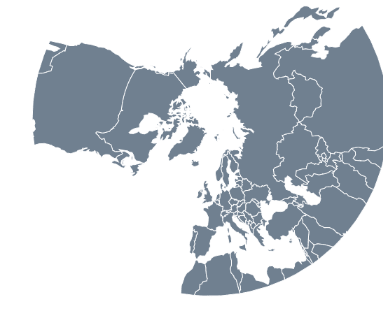

# D3 . js geognonic()函数

> 原文:[https://www.geeksforgeeks.org/d3-js-geognomonic-function/](https://www.geeksforgeeks.org/d3-js-geognomonic-function/)

D3.js 是一个 JavaScript 库，用于在 web 浏览器中产生动态的、交互式的数据可视化。它利用了可伸缩矢量图形、HTML5 和级联样式表标准。

d3.js 中的**geognomonic()函数**用于绘制 gnomonical 投影，它是一种方位角投影，将大圆投影为直线，而不考虑方位。

**语法:**

```
d3.geoGnomonic()
```

**参数:**此方法不接受任何参数。

**返回值:**该方法根据给定的 JSON 数据创建一个日晷投影。

**示例 1:** 以下示例对世界进行了日晷投影，中心位于(0，0)，没有旋转。

## 超文本标记语言

```
<!DOCTYPE html> 
<html lang="en"> 

<head> 
    <meta charset="UTF-8" /> 
    <meta name="viewport"
        content="width=device-width, 
                initial-scale=1.0"/> 

    <script src="https://d3js.org/d3.v4.js"></script> 

    <script src= 
"https://d3js.org/d3-geo-projection.v2.min.js"> 
    </script> 
</head> 

<body> 
    <div style="width:700px; height:500px;"> 
        <center> 
            <h3 style="color:black"></h3> 
        </center> 
        <svg width="600" height="450"> 
        </svg> 
    </div> 

    <script> 
        var svg = d3.select("svg"), 
        width = +svg.attr("width"), 
        height = +svg.attr("height"); 

        // Gnomonic projection 
        // Center(0,0) with 0 rotation 
        var gfg = d3.geoGnomonic() 
                    .scale(width / 1.8 / Math.PI) 
                    .rotate([0,0]) 
                    .center([0,0]) 
                    .translate([width / 2, height / 2]);

        // Loading the json data 
        d3.json("https://raw.githubusercontent.com/" 
            + "janasayantan/datageojson/master/world.json", 
            function(data){ 
                // Drawing the map 
                svg.append("g") 
                    .selectAll("path") 
                    .data(data.features) 
                    .enter().append("path") 
                    .attr("fill", "black") 
                    .attr("d", d3.geoPath() 
                        .projection(gfg) 
                    ) 
                    .style("stroke", "#ffff") 
                });
    </script> 
</body> 

</html>
```

**输出:**



无旋转且以(0，0)为中心的正圆锥投影

**示例 2:** 以下示例在自定义中心(-20、-20)并旋转-90 度 w.r.t Y 轴后，对世界进行了日晷投影。

## 超文本标记语言

```
<!DOCTYPE html> 
<html lang="en"> 

<head> 
    <meta charset="UTF-8" /> 
    <meta name="viewport"
        content="width=device-width, 
                initial-scale=1.0"/> 

    <script src="https://d3js.org/d3.v4.js"></script> 

    <script src= 
"https://d3js.org/d3-geo-projection.v2.min.js"> 
    </script> 
</head> 

<body> 
    <div style="width:700px; height:500px;"> 
        <center> 
            <h3 style="color:black"></h3> 
        </center> 
        <svg width="600" height="450"> 
        </svg> 
    </div> 

    <script> 
        var svg = d3.select("svg"), 
        width = +svg.attr("width"), 
        height = +svg.attr("height"); 

        // Gnomonic  projection  
        // Center(-20,-20) and -90 degree 
        // rotation w.r.t Y axis  
        var gfg = d3.geoGnomonic() 
                    .scale(width / 1.3 / Math.PI) 
                    .rotate([0,-90]) 
                    .center([-20,-20]) 
                    .translate([width / 2, height / 2]);

        // Loading the json data 
        d3.json("https://raw.githubusercontent.com/" 
            + "janasayantan/datageojson/master/world.json", 
            function(data){ 

                // Drawing the map 
                svg.append("g") 
                    .selectAll("path") 
                    .data(data.features) 
                    .enter().append("path") 
                    .attr("fill", "slategrey") 
                    .attr("d", d3.geoPath() 
                        .projection(gfg) 
                    ) 
                    .style("stroke", "#ffff") 
                });
    </script> 
</body> 

</html>
```

**输出:**

