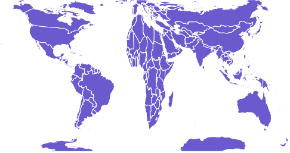
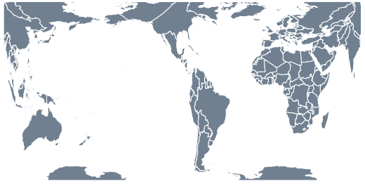

# D3.js geoGringorten()函数

> 原文:[https://www.geeksforgeeks.org/d3-js-geogringorten-function/](https://www.geeksforgeeks.org/d3-js-geogringorten-function/)

D3.js 是一个 JavaScript 库，用于在 web 浏览器中产生动态的、交互式的数据可视化。它利用了可伸缩矢量图形、HTML5 和级联样式表标准。
D3 . js 中的 **geoGringorten** ()函数用于绘制 Gringorten 正方形的等面积投影，重新排列后给每个半球一个完整的正方形。

**语法:**

```
d3.geoGringorten()
```

**参数:**此方法不接受任何参数。

**返回值:**此方法创建 Gringorten 正方形等面积投影。根据给定的 json 数据。

**示例 1:** 以下示例对中心位于(0，0)且无旋转的世界进行 Gringorten 投影。

```
<!DOCTYPE html>
<html lang="en">

<head>
    <meta charset="UTF-8" />
    <meta name="viewport" content=
        "width=device-width, initial-scale=1.0" />
    <script src="https://d3js.org/d3.v4.js"></script>
    <script src=
"https://d3js.org/d3-geo-projection.v2.min.js">
    </script>
</head>

<body>
    <div style="width:700px; height:500px;">
        <center>
            <h3 style="color:black"></h3>
        </center>
        <svg width="600" height="450"></svg>
    </div>

    <script>
        var svg = d3.select("svg"),
            width = +svg.attr("width"),
            height = +svg.attr("height");

        // Gringorten projection
        // Center(0, 0) with 0 rotation
        var gfg = d3.geoGringorten()
            .scale(width / 1.5 / Math.PI)
            .rotate([0, 0])
            .center([0, 0])
            .translate([width / 2, height / 2])

        // Loading the json data
        // Used json file stored at:
        // https://raw.githubusercontent.com/janasayantan
        // /datageojson/master/world.json
        var myURL = "https://raw.githubusercontent.com/"
            + "janasayantan/datageojson/master/world.json"

        d3.json(myURL, function (data) {

            // Draw the map
            svg.append("g")
                .selectAll("path")
                .data(data.features)
                .enter().append("path")
                .attr("fill", "SlateBlue")
                .attr("d", d3.geoPath()
                    .projection(gfg)
                )
                .style("stroke", "#ffff")
        })
    </script>
</body>

</html>
```

**输出:**



**无旋转且以(0，0)** 为中心的格林格登投影

**示例 2:** 以下示例在自定义中心和旋转后，对世界进行 Gringorten 投影。

```
<!DOCTYPE html>
<html lang="en">

<head>
    <meta charset="UTF-8" />
    <meta name="viewport" content=
        "width=device-width, initial-scale=1.0" />
    <script src="https://d3js.org/d3.v4.js"></script>
    <script src=
"https://d3js.org/d3-geo-projection.v2.min.js">
    </script>
</head>

<body>
    <div style="width:700px; height:600px;">
        <center>
            <h3 style="color:black"></h3>
        </center>
        <svg width="700" height="400"> </svg>
    </div>

    <script>
        var svg = d3.select("svg"),
            width = +svg.attr("width"),
            height = +svg.attr("height");

        // Gringorten  projection
        // Center(-20, 20) and 90 degree
        // rotation w.r.t Y axis
        var gfg = d3.geoGringorten()
            .scale(width / 1.5 / Math.PI)
            .rotate([90, 0])
            .center([-20, 20])
            .translate([width / 2, height / 2])

        // Loading the json data
        // Used json file stored at:
        // https://raw.githubusercontent.com/janasayantan
        // /datageojson/master/world.json
        var myURL = "https://raw.githubusercontent.com/"
            + "janasayantan/datageojson/master/world.json"

        d3.json(myURL, function (data) {

            // Draw the map
            svg.append("g")
                .selectAll("path")
                .data(data.features)
                .enter().append("path")
                .attr("fill", "SlateGrey")
                .attr("d", d3.geoPath()
                    .projection(gfg)
                )
                .style("stroke", "#ffff")
        })
    </script>
</body>

</html>
```

**输出:**



**相对于 Y 轴旋转 90 度并以(-20，20** )为中心的格林格登投影