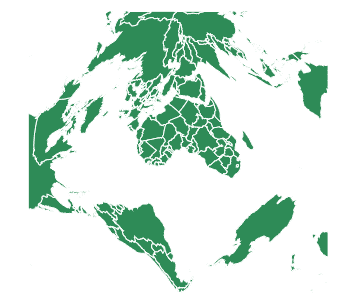
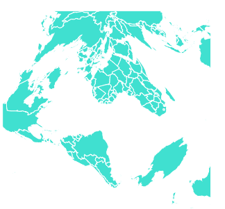

# D3 . js geogringortenquinchal()函数

> 原文:[https://www . geeksforgeeks . org/D3-js-geogringortenquinchial-function/](https://www.geeksforgeeks.org/d3-js-geogringortenquincuncial-function/)

**D3.js** 是一个 JavaScript 库，使用 HTML5、可伸缩矢量图形和级联样式表为网页提供交互式数据可视化。 **D3.js** 的**geogringortenquinchal**()功能用于绘制 **Gringorten** 正方形等面积投影。

**语法:**

```
d3.geoGringortenQuincuncial()
```

**参数:**此方法不接受任何参数。

**返回值:**该方法根据给定的 JSON 数据创建 Gringorten 正方形等面积投影。

**示例 1:** 以下示例绘制了以(0，0)和 0°旋转为中心的世界的**geogringrtenquincharal**投影。

## 超文本标记语言

```
<!DOCTYPE html>
<html lang="en">

<head>
    <meta charset="UTF-8" />
    <meta name="viewport" content="width=device-width, 
                initial-scale=1.0" />
</head>

<body>
    <div style="width:700px; height:500px;">

        <svg width="600" height="450">
        </svg>
    </div>

    <script src=
        "https://d3js.org/d3.v4.js">
    </script>

    <script src=
"https://d3js.org/d3-geo-projection.v2.min.js">
    </script>

    <script>
        var svg = d3.select("svg"),
            width = +svg.attr("width"),
            height = +svg.attr("height");

        // GringortenQuincuncial projection
        // Center(0, 0) with 0 rotation
        var gfg = d3.geoGringortenQuincuncial()
            .scale(width / 1.8 / Math.PI)
            .rotate([0, 0])
            .center([0, 0])
            .translate([width / 2, height / 2])

        // Loading the json data
        // Used json file stored at 
        // https://raw.githubusercontent.com/janasayantan
        // /datageojson/master/world.json
        d3.json("https://raw.githubusercontent.com/"
            + "janasayantan/datageojson/master/world.json",
            function (data) {
                // Drawing the map
                svg.append("g")
                    .selectAll("path")
                    .data(data.features)
                    .enter().append("path")
                    .attr("fill", "SeaGreen")
                    .attr("d", d3.geoPath()
                        .projection(gfg)
                    )
                    .style("stroke", "#ffff")
            })
    </script>
</body>

</html>
```

**输出:**下面的输出显示了没有旋转且以(0，0)为中心的世界的 GringortenQuincuncial 投影



**示例 2:** 以下示例在改变中心和旋转后，绘制世界的 GringortenQuincuncial 投影。

## 超文本标记语言

```
<!DOCTYPE html>
<html lang="en">

<head>
    <meta charset="UTF-8" />
    <meta name="viewport" content="width=device-width, 
                initial-scale=1.0" />
</head>

<body>
    <div style="width:700px; height:600px;">
        <svg width="500" height="450"></svg>
    </div>

    <script src="https://d3js.org/d3.v4.js">
    </script>

    <script src=
"https://d3js.org/d3-geo-projection.v2.min.js">
    </script>

    <script>
        var svg = d3.select("svg"),
            width = +svg.attr("width"),
            height = +svg.attr("height");

        // GringortenQuincuncial  projection
        // Center(0, 20) and 20 degree 
        // rotation to Y axis
        var gfg = d3.geoGringortenQuincuncial()
            .scale(width / 1.5 / Math.PI)
            .rotate([20, 0])
            .center([0, 20])
            .translate([width / 2, height / 2])

        // Loading the json data
        // Used json file stored at 
        // https://raw.githubusercontent.com/janasayantan
        // /datageojson/master/world.json
        d3.json("https://raw.githubusercontent.com/"
            + "janasayantan/datageojson/master/world.json",
            function (data) {

                // Draw the map
                svg.append("g")
                    .selectAll("path")
                    .data(data.features)
                    .enter().append("path")
                    .attr("fill", "Turquoise")
                    .attr("d", d3.geoPath()
                        .projection(gfg)
                    )
                    .style("stroke", "#ffff")
            })
    </script>
</body>

</html>
```

**输出:**下面的输出显示了相对于 Y 轴旋转 20 度并以(0，20)为中心的 GringortenQuincuncial 投影

