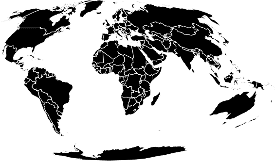
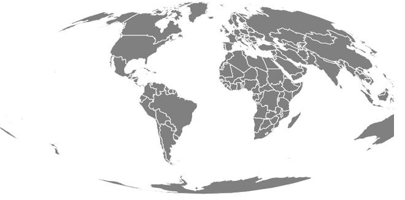

# D3.js geoHomolosine()函数

> 原文:[https://www.geeksforgeeks.org/d3-js-geohomolosine-function/](https://www.geeksforgeeks.org/d3-js-geohomolosine-function/)

JavaScript **D3.js** 库使用 HTML5、可伸缩矢量图形和级联样式表为网页提供动态和交互式数据可视化。
使用 **d3.js** 中的**geo homoloine()**函数绘制伪圆柱形等面积 Goode homolosine 投影。

**语法:**

```
d3.geoHomolosine()
```

**参数:**此方法不接受任何参数。

**返回值:**该方法根据给定的 JSON 数据创建同音投影。

**示例 1:** 以下示例绘制了以(0，0)为中心，0°旋转的世界的同音投影。

## 超文本标记语言

```
<!DOCTYPE html>
<html lang="en">

<head>
    <meta charset="UTF-8" />
    <meta name="viewport" content="width=device-width, 
                initial-scale=1.0" />
    <script src="https://d3js.org/d3.v4.js"></script>
    <script src=
    "https://d3js.org/d3-geo-projection.v2.min.js">
    </script>
</head>

<body>
    <div style="width:700px; height:600px;">
        <svg width="700" height="400"></svg>
    </div>

    <script>

        var svg = d3.select("svg"),
            width = +svg.attr("width"),
            height = +svg.attr("height");

        // Homolosine  projection
        // Center(0, 0) and no rotation 
        var gfg = d3.geoHomolosine()
            .scale(width / 1.8 / Math.PI)
            .rotate([0, 0])
            .center([0, 0])
            .translate([width / 2, height / 2])

        // Loading the json data
        // Used json file stored at 
        // https://raw.githubusercontent.com/janasayantan
        // /datageojson/master/world.json
        d3.json("https://raw.githubusercontent.com/"
            + "janasayantan/datageojson/master/world.json",
            function (data) {
                // Draw the map
                svg.append("g")
                    .selectAll("path")
                    .data(data.features)
                    .enter().append("path")
                    .attr("fill", "Black")
                    .attr("d", d3.geoPath()
                        .projection(gfg)
                    )
                    .style("stroke", "#ffff")
            })
    </script>
</body>

</html>
```

**输出:**下图显示的是世界的同音投影，没有旋转，以(0，0)为中心



**示例 2:** 以下示例绘制了改变中心和旋转后的世界的同音投影。

## 超文本标记语言

```
<!DOCTYPE html>
<html lang="en">

<head>
    <meta charset="UTF-8" />
    <meta name="viewport" content="width=device-width, 
                initial-scale=1.0" />
    <script src="https://d3js.org/d3.v4.js"></script>
    <script src=
    "https://d3js.org/d3-geo-projection.v2.min.js">
    </script>
</head>

<body>
    <div style="width:700px; height:600px;">

        <svg width="700" height="400">
        </svg>
    </div>

    <script>
        var svg = d3.select("svg"),
            width = +svg.attr("width"),
            height = +svg.attr("height");

        // Homolosine  projection
        // Center(-10, -10) and 30 degree
        // rotation w.r.t Y axis
        var gfg = d3.geoHomolosine()
            .scale(width / 1.8 / Math.PI)
            .rotate([30, 0])
            .center([-10, -10])
            .translate([width / 2, height / 2])

        // Loading the json data
        // Used json file stored at 
        //  https://raw.githubusercontent.com/janasayantan
        // /datageojson/master/world.json
        d3.json("https://raw.githubusercontent.com/"
            + "janasayantan/datageojson/master/world.json",
            function (data) {

                // Draw the map
                svg.append("g")
                    .selectAll("path")
                    .data(data.features)
                    .enter().append("path")
                    .attr("fill", "grey")
                    .attr("d", d3.geoPath()
                        .projection(gfg)
                    )
                    .style("stroke", "#ffff")
            })
    </script>
</body>

</html>
```

**输出:**以下输出显示了相对于 Y 轴旋转 30 度并以(-10、-10)为中心的同曲面投影

