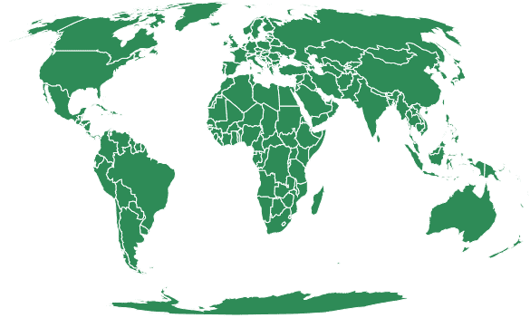
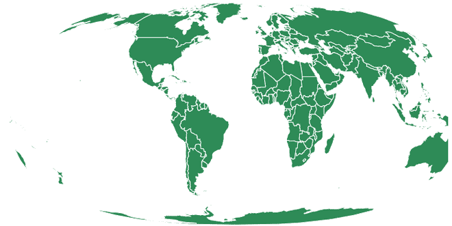

# D3 . js geohyperellicocal()函数

> 原文:[https://www . geeksforgeeks . org/D3-js-geohyperellipical-function/](https://www.geeksforgeeks.org/d3-js-geohyperelliptical-function/)

JavaScript 库 **D3.js** 使用 HTML5、可伸缩矢量图形和级联样式表为网页提供动态的交互式数据可视化。
使用 **d3.js** 库中的**geohyperellipical()**函数绘制伪圆柱形的等面积 Goode 同质投影。

**语法:**

```
d3.geoHyperelliptical( k, alpha ,gamma)
```

**参数:**该方法接受三个参数，如上所述，如下所述。

*   **k:** 定义经脉形状的超椭圆(或拉梅曲线)的指数。默认值为 2.5。
*   **α:**它控制圆柱投影的重量，该重量用超椭圆平均。默认值为 0。
*   **γ:**长宽比。默认值为 1.183136。

**返回值:**该方法根据给定的 JSON 数据创建超椭圆投影。

**示例 1:** 以下示例绘制了世界的超椭圆投影，中心位于(0，0)且旋转为 0。

## 超文本标记语言

```
<!DOCTYPE html>
<html lang="en">

<head>
    <meta charset="UTF-8" />
    <meta name="viewport" content=
        "width=device-width, initial-scale=1.0" />
    <script src="https://d3js.org/d3.v4.js"></script>
    <script src=
    "https://d3js.org/d3-geo-projection.v2.min.js">
    </script>
</head>

<body>
    <div style="width:700px; height:600px;">
        <svg width="700" height="400">
        </svg>
    </div>

    <script>
        var svg = d3.select("svg"),
            width = +svg.attr("width"),
            height = +svg.attr("height");

        // Hyperelliptical projection
        // Center(0,0) and no rotation 
        var gfg = d3.geoHyperelliptical()
            .scale(width / 2.0 / Math.PI)
            .rotate([0, 0])
            .center([0, 0])
            .translate([width / 2, height / 2])

        // Loading the json data
        // Used json file stored at 
        // https://raw.githubusercontent.com/janasayantan
        // datageojson/master/world.json
        d3.json("https://raw.githubusercontent.com/
            + "janasayantan/datageojson/master/world.json",
            function (data) {

                // Draw the map
                svg.append("g")
                    .selectAll("path")
                    .data(data.features)
                    .enter().append("path")
                    .attr("fill", "seagreen")
                    .attr("d", d3.geoPath()
                        .projection(gfg)
                    )
                    .style("stroke", "#ffff")
            })
    </script>
</body>

</html>
```

**输出:**



**示例 2:** 以下示例在改变中心和旋转后绘制世界的超椭圆投影。

## 超文本标记语言

```
<!DOCTYPE html>
<html lang="en">

<head>
    <meta charset="UTF-8" />
    <meta name="viewport" content=
    "width=device-width, initial-scale=1.0" />
    <script src="https://d3js.org/d3.v4.js"></script>
    <script src=
    "https://d3js.org/d3-geo-projection.v2.min.js">
    </script>
</head>

<body>
    <div style="width:700px; height:600px;">
        <svg width="700" height="400"></svg>
    </div>

    <script>

        var svg = d3.select("svg"),
            width = +svg.attr("width"),
            height = +svg.attr("height");

        // Hyperelliptical projection
        // Center(-10,-10) and 30 degree 
        // rotation with respect to Y axis
        var gfg = d3.geoHyperelliptical(
            k = 3.0, alpha = 2, gamma = 2)
            .scale(width / 2.0 / Math.PI)
            .rotate([30, 0])
            .center([-10, -10])
            .translate([width / 2, height / 2])

        // Loading the json data
        // Used json file stored at 
        // https://raw.githubusercontent.com
        // /janasayantan/datageojson/master/world.json

        d3.json("https://raw.githubusercontent.com/"
            + "janasayantan/datageojson/master/world.json",
            function (data) {

                // Draw the map
                svg.append("g")
                    .selectAll("path")
                    .data(data.features)
                    .enter().append("path")
                    .attr("fill", "seagreen")
                    .attr("d", d3.geoPath()
                        .projection(gfg)
                    )
                    .style("stroke", "#ffff")
            })
    </script>
</body>

</html>
```

**输出:**

