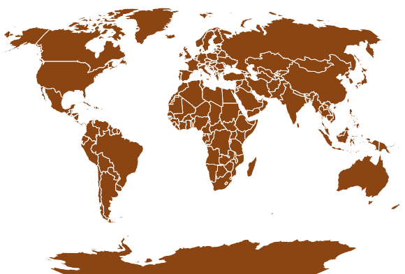
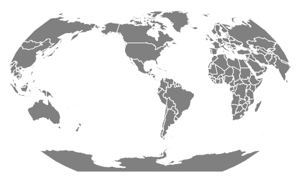

# D3.js geoKavrayskiy7()功能

> 原文:[https://www . geesforgeks . org/D3-js-geokavrayskiy 7-function/](https://www.geeksforgeeks.org/d3-js-geokavrayskiy7-function/)

**d3.js** 中的 **geoKavrayskiy7()** 函数用于从给定的 geojson 数据绘制 **Kavrayskiy VII 伪圆柱投影**。

**语法:**

```
d3.geoKavrayskiy7()
```

**参数**:此方法不接受任何参数。

**返回**:此方法返回 Kavrayskiy7 投影。

**示例 1** :以下示例绘制世界的 Kavrayskiy7 投影，中心在(0，0)，旋转 0 度。

## 超文本标记语言

```
<!DOCTYPE html>
<html>

<head>
    <script src="https://d3js.org/d3.v4.js">
    </script>
    <script src=
"https://d3js.org/d3-geo-projection.v2.min.js">
    </script>
</head>

<body>
    <div style="width:700px; height:500px;">
        <center>
            <h3 style="color:black"></h3>
        </center>
        <svg width="600" height="450">
        </svg>
    </div>

    <script>
        var svg = d3.select("svg"),
            width = +svg.attr("width"),
            height = +svg.attr("height");

        // Kavrayskiy7 projection with
        // the center at (0, 0) and rotation
        // of 0 degrees
        var gfg = d3.geoKavrayskiy7()
            .scale(width / 1.5 / Math.PI)
            .rotate([0, 0])
            .center([0, 0])
            .translate([width / 2, height / 2])

        // Loading the json data
        d3.json("https://raw.githubusercontent.com/" +
            "janasayantan/datageojson/master/" +
            "world.json",
            function (data) {

                // Drawing the map
                svg.append("g")
                    .selectAll("path")
                    .data(data.features)
                    .enter().append("path")
                    .attr("fill", "SaddleBrown")
                    .attr("d", d3.geoPath()
                        .projection(gfg)
                    )
                    .style("stroke", "#ffff")
            });
    </script>
</body>

</html>
```

**输出:**



**示例 2:** 以下示例绘制了世界的 Kavrayskiy7 投影，中心位于(-10，0)，相对于 y 轴旋转 90 度。

## 超文本标记语言

```
<!DOCTYPE html>
<html>

<head>
    <script src="https://d3js.org/d3.v4.js">
    </script>
    <script src=
"https://d3js.org/d3-geo-projection.v2.min.js">
    </script>
</head>

<body>
    <div style="width:700px; height:600px;">
        <center>
            <h3 style="color:black"></h3>
        </center>
        <svg width="500" height="450">
        </svg>
    </div>

    <script>
        var svg = d3.select("svg"),
            width = +svg.attr("width"),
            height = +svg.attr("height");

        // Kavrayskiy7 projection with the
        // center at (0,0) and rotation of 
        // 90 degrees with respect to the y-axis
        var gfg = d3.geoKavrayskiy7()
            .scale(width / 1.8 / Math.PI)
            .rotate([90, 0])
            .center([-10, 0])
            .translate([width / 2, height / 2]);

        // Loading the json data
        d3.json("https://raw.githubusercontent.com/" +
            "janasayantan/datageojson/master/" +
            "world.json",
            function (data) {

                // Draw the map
                svg.append("g")
                    .selectAll("path")
                    .data(data.features)
                    .enter().append("path")
                    .attr("fill", "grey")
                    .attr("d", d3.geoPath()
                        .projection(gfg)
                    )
                    .style("stroke", "#ffff")
            });
    </script>
</body>

</html>
```

**输出:**

