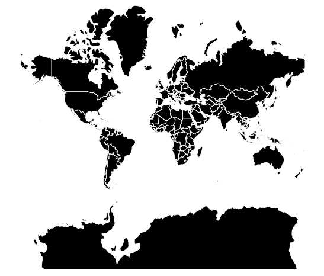
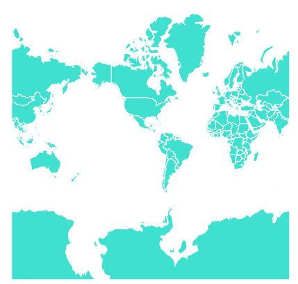

# D3.js 几何器()功能

> 原文:[https://www.geeksforgeeks.org/d3-js-geomercator-function/](https://www.geeksforgeeks.org/d3-js-geomercator-function/)

D3.js 是一个 JavaScript 库，用于在 web 浏览器中产生动态的、交互式的数据可视化。它利用了可伸缩矢量图形、HTML5 和级联样式表标准。d3.js 中的**几何图形**()函数用于绘制球面墨卡托投影。

**语法:**

```
d3.geoMercator()
```

**参数:**此方法不接受任何参数。

**返回:**该方法根据给定的 json 数据创建墨卡托投影。

**示例#1:** 以下示例绘制世界的墨卡托投影，中心位于(0，0)且旋转为 0。

```
<!DOCTYPE html>
<html lang="en">
    <head>
        <meta charset="UTF-8" />
        <meta
            name="viewport"
            content="width=device-width, 
                initial-scale=1.0"
        />
    </head>

    <body>
        <div style="width: 700px; height: 500px;">
            <center>
                <h3 style="color: black;"></h3>
            </center>

            <svg width="600" 
                 height="450"></svg>
        </div>
        <script src="https://d3js.org/d3.v4.js"></script>
        <script src=
                "https://d3js.org/d3-geo-projection.v2.min.js">
      </script>
        <script>
            var svg = d3.select("svg"),
                width = +svg.attr("width"),
                height = +svg.attr("height");

            // Mercator projection
            // Center(0, 0) with 0 rotation
            var gfg = d3
                .geoMercator()
                .scale(width / 2.5 / Math.PI)
                .rotate([0, 0])
                .center([0, 0])
                .translate([width / 2, height / 2]);

            // Loading the json data
            // Used json file stored at
/*https://raw.githubusercontent.com/janasayantan
             /datageojson/master/world.json*/
            d3.json(
"https://raw.githubusercontent.com/janasayantan/datageojson/master/world.json", 
              function (data) {
                // Drawing the map
                svg.append("g").selectAll(
                  "path").data(data.features).enter().append(
                  "path").attr("fill", "black").attr(
                  "d", d3.geoPath().projection(gfg)).style(
                  "stroke", "#ffff");
            });
        </script>
    </body>
</html>
```

**输出:**



世界墨卡托投影，无旋转，以(0，0)为中心

**示例#2:** 以下示例在改变中心和旋转后绘制世界的墨卡托投影。

```
<!DOCTYPE html>
<html lang="en">
    <head>
        <meta charset="UTF-8" />
        <meta
            name="viewport"
            content="width=device-width, 
                initial-scale=1.0"
        />
    </head>

    <body>
        <div style="width: 700px; height: 600px;">
            <center>
                <h3 style="color: black;"></h3>
            </center>

            <svg width="500" height="450"></svg>
        </div>
        <script src="https://d3js.org/d3.v4.js"></script>
        <script src=
             "https://d3js.org/d3-geo-projection.v2.min.js">
      </script>
        <script>
            var svg = d3.select("svg"),
                width = +svg.attr("width"),
                height = +svg.attr("height");

            // Mercator  projection
 // Center(20, 20) and 90 degree rotation w.r.t Y axis
            var gfg = d3
                .geoMercator()
                .scale(width / 2.5 / Math.PI)
                .rotate([90, 0])
                .center([20, 20])
                .translate([width / 2, height / 2]);

            // Loading the json data
            // Used json file stored at 
/*https://raw.githubusercontent.com/janasayantan
            /datageojson/master/world.json*/
            d3.json(
"https://raw.githubusercontent.com/janasayantan/datageojson/master/world.json",
              function (data) {
                // Draw the map
                svg.append("g").selectAll(
                  "path").data(data.features).enter().append(
                  "path").attr("fill", "Turquoise").attr(
                  "d", d3.geoPath().projection(gfg)).style(
                  "stroke", "#ffff");
            });
        </script>
    </body>
</html>
```

**输出:**



相对于 Y 轴旋转 90 度并以(20，20)为中心的墨卡托投影