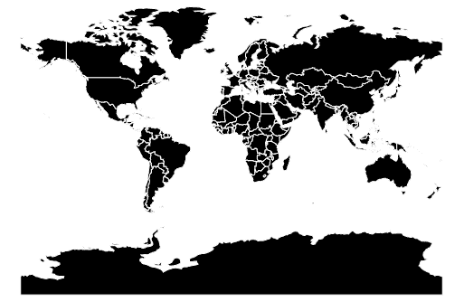
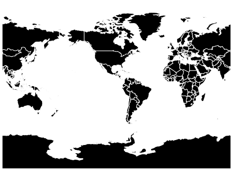

# D3.js geoMiller()函数

> 原文:[https://www.geeksforgeeks.org/d3-js-geomiller-function/](https://www.geeksforgeeks.org/d3-js-geomiller-function/)

d3.js 中的 **geoMiller()** 函数用于绘制给定 geojson 数据的 **Miller 圆柱投影**。

**语法:**

```
d3.geoMiller()
```

**参数:**此方法不接受任何参数。

**返回:**此方法绘制米勒圆柱投影。

**示例 1:** 以下示例绘制了以(0，0)为中心，旋转 0 度的世界的米勒投影。

## 超文本标记语言

```
<!DOCTYPE html>
<html>
<head>
  <script src=
"https://d3js.org/d3.v4.js">
  </script>
  <script src=
"https://d3js.org/d3-geo-projection.v2.min.js">
  </script>
</head>
<body>
  <div style="width:700px; height:500px;">
    <svg width="600" height="450"></svg>
  </div>
  <script>
    var svg = d3.select("svg"),
      width = +svg.attr("width"),
      height = +svg.attr("height");

    // Miller projection with the
    // Center at (0, 0) and rotation
    // of 0 degrees
    var gfg = d3.geoMiller()
      .scale(width / 1.8 / Math.PI)
      .rotate([0, 0])
      .center([0, 0])
      .translate([width / 2, height / 2]);

    // Loading the json data
    d3.json("https://raw.githubusercontent.com/" +
            "janasayantan/datageojson/master/" +
            "world.json",
            function (data) {

      // Drawing the map
      svg.append("g")
        .selectAll("path")
        .data(data.features)
        .enter().append("path")
        .attr("fill", "Black")
        .attr("d", d3.geoPath()
          .projection(gfg)
        )
        .style("stroke", "#ffff")
    });
  </script>
</body>
</html>
```

**输出:**



**示例 2:** 以下示例绘制世界的米勒投影，中心位于(-10，0)，相对于 y 轴旋转 90 度。

## 超文本标记语言

```
<html>
<head>
  <script src=
"https://d3js.org/d3.v4.js">
  </script>
  <script src=
"https://d3js.org/d3-geo-projection.v2.min.js">
  </script>
</head>
<body>
  <div style="width:700px; height:600px;">
    <svg width="500" height="450"></svg>
  </div>
  <script>
    var svg = d3.select("svg"),
      width = +svg.attr("width"),
      height = +svg.attr("height");

    // Miller projection with the
    // Center at (-10, 0) and a rotation of 
    // 90 degrees w.r.t y-axis
    var gfg = d3.geoMiller()
      .scale(width / 1.8 / Math.PI)
      .rotate([90, 0])
      .center([-10, 0])
      .translate([width / 2, height / 2]);

    // Loading the json data
    d3.json("https://raw.githubusercontent.com/" +
            "janasayantan/datageojson/master/" +
            "world.json",
            function (data) {

      // Draw the map
      svg.append("g")
        .selectAll("path")
        .data(data.features)
        .enter().append("path")
        .attr("fill", "black")
        .attr("d", d3.geoPath()
          .projection(gfg)
        )
        .style("stroke", "#ffff")
    });
  </script>
</body>
</html>
```

**输出:**

