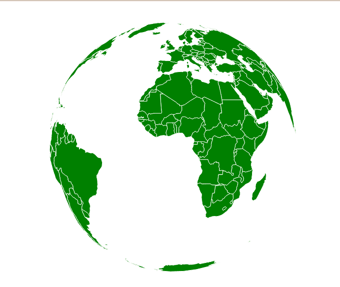
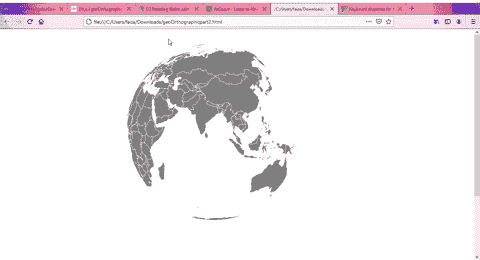

# D3.js 地理正投影()功能

> 原文:[https://www . geeksforgeeks . org/D3-js-geo professional-function/](https://www.geeksforgeeks.org/d3-js-geoorthographic-function/)

Javascript **D3。Js 地理正投影()**功能给我们提供了**方位正投影**投影。当我们想把地球看成一个三维物体，把它的两个半球分开时，这是很有用的。

**语法:**

```
d3.geoOrthographic()
```

**参数:**此方法不接受任何参数。

**返回值:**这个方法从给定的 JSON 数据中创建并返回 geoprofessional()投影。

让我们看一个例子来理解我们如何使用 GeoProfessional()函数。

**例 1:无旋转的正投影**

## 超文本标记语言

```
<!DOCTYPE html> 
<html lang="en"> 

<head> 
    <meta charset="UTF-8" /> 
    <meta name="viewport" content="width=device-width, 
                initial-scale=1.0" /> 

    <script src="https://d3js.org/d3.v4.js"></script> 

    <script src= 
"https://d3js.org/d3-geo-projection.v2.min.js"> 
    </script>
</head> 

<body> 
    <div> 
        <svg width="1200" height="850"> 
        </svg> 
    </div> 

    <script> 
        var svg = d3.select("svg"), 
            width = +svg.attr("width"), 
            height = +svg.attr("height"); 

        // The orthographic Earth projection 
        // Center(0,0) and no rotation 
        var projection = d3.geoOrthographic()
            .center([0, 0]) 
            .scale(250)
            .clipAngle(90 )
            .translate([width / 2, height / 3]) 
            .rotate([0,0])

       // Loading data from json
       d3.json("https://raw.githubusercontent.com/"
           +"epistler999/GeoLocation/master/world.json", 
           function (data) { 

                // Draw the map 
                svg.append("g") 
                    .selectAll("path") 
                    .data(data.features) 
                    .enter().append("path") 
                    .attr("fill", "green") 
                    .attr("d", d3.geoPath() 
                        .projection(projection) 
                    ) 
                    .style("stroke", "#ffff")
            }) 
    </script> 
</body>

</html>
```

**输出:**



**示例 2:具有旋转的正投影**

## 超文本标记语言

```
<!DOCTYPE html> 
<html lang="en"> 

<head> 
    <meta charset="UTF-8" /> 
    <meta name="viewport" content=
        "width=device-width,initial-scale=1.0" /> 
    <script src="https://d3js.org/d3.v4.js"></script> 
    <script src=
"https://d3js.org/d3-geo-projection.v2.min.js">
    </script>  
</head> 

<body> 
    <div> 
        <svg width="1200" height="850"> 
        </svg> 
    </div> 

    <script> 
        var svg = d3.select("svg"), 
            width = +svg.attr("width"), 
            height = +svg.attr("height"); 

        const config = {
            speed: 0.010,
            verticalTilted: -10,
            horizontalTilted: 0
        }

        // The orthographic Earth projection 
        // Center(0,0) and no rotation 
        var projection = d3.geoOrthographic()
            .center([0, 0]) 
            .scale(250)
            .clipAngle(90 )
            .translate([width / 2, height / 3]) 
            .rotate([0,0])

        const path = d3.geoPath().projection(projection);

        // Calling rotate() function for rotation of globe
        Rotate();

        // Loading data from json
        d3.json("https://raw.githubusercontent.com/"
            +"epistler999/GeoLocation/master/world.json", 
            function (data) { 

                // Draw the map 
                svg.append("g") 
                    .selectAll("path") 
                    .data(data.features) 
                    .enter().append("path") 
                    .attr("fill", "grey") 
                    .attr("d", d3.geoPath() 
                        .projection(projection) 
                    ) 
                    .style("stroke", "#ffff") 
        }) 

        // Function to rotate() projection of globe.
        function Rotate() {
            d3.timer(function (elapsed) {
                projection.rotate(
                    [config.speed*elapsed-120, 
                    config.verticalTilted, 
                    config.horizontalTilted]);
                    svg.selectAll("path").attr("d", path);
                });
            }   
    </script> 
</body>

</html>
```

**输出:**

