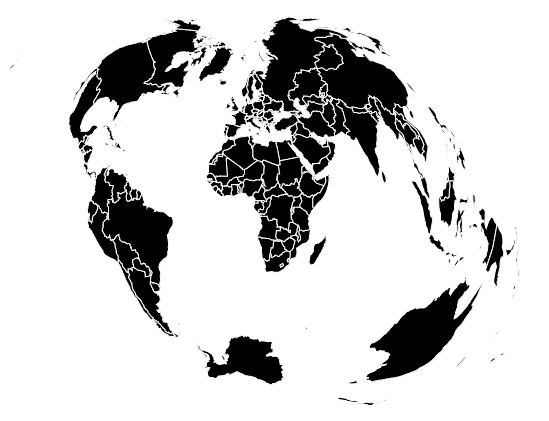

# D3 . js geoRectangularPolyconic()函数

> 原文:[https://www . geesforgeks . org/D3-js-geortactangularpolyconic-function/](https://www.geeksforgeeks.org/d3-js-georectangularpolyconic-function/)

JavaScript **D3.js** 库使用 HTML5、可缩放矢量图形和级联样式表为网页提供交互式数据可视化。JavaScript **d3.js** 库的**geortactangularpolyconic()**功能用于绘制矩形多边形投影。

**语法:**

```
d3.geoRectangularPolyconic()

```

**参数:**此方法不接受任何参数。

**返回值:**该方法根据给定的 JSON 数据创建矩形多曲面投影。

**示例 1:** 以下示例创建世界的矩形多曲面投影，中心位于(0，0)且无旋转。

## 超文本标记语言

```
<!DOCTYPE html> 
<html lang="en"> 

<head> 
    <meta charset="UTF-8" /> 
    <meta name="viewport"
        content="width=device-width, 
                initial-scale=1.0"/> 
    <script src="https://d3js.org/d3.v4.js"></script> 
    <script src= 
"https://d3js.org/d3-geo-projection.v2.min.js"> 
    </script> 
</head> 

<body> 
    <div style="width:700px; height:500px;"> 
        <center> 
            <h3 style="color:black"></h3> 
    </center> 
    <svg width="600" height="450"> 
    </svg> 
    </div> 

    <script> 

    var svg = d3.select("svg"), 
    width = +svg.attr("width"), 
    height = +svg.attr("height"); 

    // RectangularPolyconic projection 
    // Center(0, 0) with 0 rotation 
    var gfg = d3.geoRectangularPolyconic() 
                .scale(width / 1.8 / Math.PI) 
                .rotate([0, 0]) 
                .center([0, 0]) 
                .translate([width / 2, height / 2]) 

    // Loading the json data 
    // Used json file stored at 
    // https://raw.githubusercontent.com/janasayantan 
    // /datageojson/master/world.json 
    d3.json("https://raw.githubusercontent.com/" 
    + "janasayantan/datageojson/master/world.json", 
    function(data){ 

        // Drawing the map 
        svg.append("g") 
            .selectAll("path") 
            .data(data.features) 
            .enter().append("path") 
            .attr("fill", "black") 
            .attr("d", d3.geoPath() 
                .projection(gfg) 
            ) 
            .style("stroke", "#ffff") 
        }) 
    </script> 
</body>
</html> 
```

**输出:**



**示例 2:** 在下面的示例中，我们将创建世界的帕特森投影，中心位于(0，-20)并相对于 Y 轴旋转 30 度。

## 超文本标记语言

```
<!DOCTYPE html> 
<html lang="en"> 

<head> 
    <meta charset="UTF-8" /> 
    <meta name="viewport"
        content="width=device-width, 
                initial-scale=1.0"/> 
    <script src="https://d3js.org/d3.v4.js"></script> 
    <script src= 
      "https://d3js.org/d3-geo-projection.v2.min.js"> 
    </script> 
</head> 

<body> 
    <div style="width:700px; height:500px;"> 
        <center> 
            <h3 style="color:black"></h3> 
       </center> 
    <svg width="600" height="450"> 
    </svg> 
    </div> 

    <script> 

     var svg = d3.select("svg"), 
     width = +svg.attr("width"), 
     height = +svg.attr("height"); 

    // RectangularPolyconic  projection  
    // Center(0, -20) and 30 degree 
    // rotation w.r.t Y axis  
    var gfg = d3.geoRectangularPolyconic() 
                .scale(width / 2.3 / Math.PI) 
                .rotate([0, 30]) 
                .center([0, -20]) 
                .translate([width / 2, height / 2]) 

    // Loading the json data 
    // Used json file stored at 
    // https://raw.githubusercontent.com/janasayantan 
    // /datageojson/master/world.json 
    d3.json("https://raw.githubusercontent.com/" 
      + "janasayantan/datageojson/master/world.json", 
    function(data){ 

        // Drawing the map 
        svg.append("g") 
            .selectAll("path") 
            .data(data.features) 
            .enter().append("path") 
            .attr("fill", "grey") 
            .attr("d", d3.geoPath() 
                .projection(gfg) 
            ) 
            .style("stroke", "#ffff") 
        }) 
    </script> 
</body> 
</html> 
```

**输出:**

