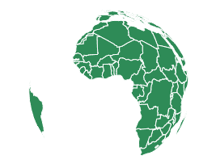
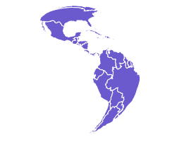

# D3.js geoSatellite()功能

> 原文:[https://www.geeksforgeeks.org/d3-js-geosatellite-function/](https://www.geeksforgeeks.org/d3-js-geosatellite-function/)

JavaScript **D3.js** 库使用 HTML5、可缩放矢量图形和级联样式表为网页提供交互式数据可视化。 **d3.js** 中的**地理卫星**()功能用于绘制**卫星**(倾斜透视)投影。

**语法:**

```
d3.geoSatellite()
```

**参数:**此方法不接受任何参数。

**返回值:**该方法根据给定的 JSON 数据创建卫星投影。

**示例 1:** 以下示例创建世界的卫星投影，中心位于(0，0)且无旋转。

## 超文本标记语言

```
<!DOCTYPE html> 
<html lang="en"> 

<head> 
    <meta charset="UTF-8" /> 
    <meta name="viewport"
        content="width=device-width, 
                initial-scale=1.0"/> 
    <script src="https://d3js.org/d3.v4.js"></script>
    <script src=
"https://d3js.org/d3-geo-projection.v2.min.js">
    </script>
</head> 

<body> 
    <div style="width:700px; height:500px;"> 
        <center> 
            <h3 style="color:black"></h3>  
       </center>
       <svg width="600" height="450"> 
       </svg> 
    </div> 

    <script>

       var svg = d3.select("svg"),
       width = +svg.attr("width"),
       height = +svg.attr("height");

       // Satellite projection
       // Center(0,0) with 0 rotation
       var gfg = d3.geoSatellite()
                 .scale(width / 1.1 / Math.PI)
                 .rotate([0,0])
                 .center([0,0])
                 .translate([width / 2, height / 2])

       // Loading the json data
       // Used json file stored at 
       // https://raw.githubusercontent.com/janasayantan
       // /datageojson/master/world.json
       d3.json("https://raw.githubusercontent.com/"
       + "janasayantan/datageojson/master/world.json", 
       function(data){

           // Drawing the map
           svg.append("g")
              .selectAll("path")
              .data(data.features)
              .enter().append("path")
              .attr("fill", "SeaGreen")
              .attr("d", d3.geoPath()
                  .projection(gfg)
               )
              .style("stroke", "#ffff")
        })
    </script>
</body> 

</html>
```

**输出:**



**示例 2:** 在下面的示例中，我们将创建世界的卫星投影，中心位于(0，-20)并相对于 Y 轴旋转 90 度。

## 超文本标记语言

```
<!DOCTYPE html> 
<html lang="en"> 

<head> 
    <meta charset="UTF-8" /> 
    <meta name="viewport"
        content="width=device-width, 
                initial-scale=1.0"/>
    <script src="https://d3js.org/d3.v4.js"></script>
    <script src=
"https://d3js.org/d3-geo-projection.v2.min.js">
    </script>
</head> 

<body> 
    <div style="width:700px; height:600px;"> 
        <center> 
          <h3 style="color:black"></h3>
        </center>

        <svg width="500" height="450"> 
        </svg> 
    </div> 

    <script>

        var svg = d3.select("svg"),
        width = +svg.attr("width"),
        height = +svg.attr("height");

        // Satellite  projection
        // Center(0,-20) and 90 degree
        // rotation w.r.t Y axis
        var gfg = d3.geoSatellite()
                  .scale(width / 1.0/ Math.PI)
                  .rotate([90,0])
                  .center([0,-20])
                  .translate([width / 2, height / 2])

        // Loading the json data
        // Used json file stored at 
        // https://raw.githubusercontent.com/janasayantan
        // /datageojson/master/world.json
        d3.json("https://raw.githubusercontent.com/"
        + "janasayantan/datageojson/master/world.json", 
        function(data){

           // Draw the map
           svg.append("g")
              .selectAll("path")
              .data(data.features)
              .enter().append("path")
              .attr("fill", "SlateBlue")
              .attr("d", d3.geoPath()
                  .projection(gfg)
              )
              .style("stroke", "#ffff")
        })
    </script>
</body> 

</html>
```

**输出:**

