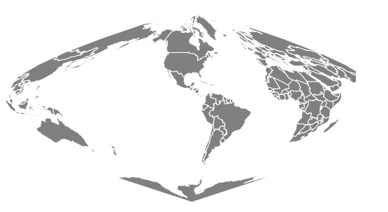

# D3.js 地球正弦()函数

> 原文:[https://www.geeksforgeeks.org/d3-js-geosinusoidal-function/](https://www.geeksforgeeks.org/d3-js-geosinusoidal-function/)

JavaScript **D3.js** 库使用 HTML5、可缩放矢量图形和级联样式表为网页提供交互式数据可视化。 **d3.js** 中的**地球正弦**()功能用于绘制**正弦**投影。

**语法:**

```
d3.geoSinusoidal()

```

**参数**:此方法不接受任何参数。

**返回**:该方法根据给定的 JSON 数据创建正弦投影。

**示例#1 :** 以下示例创建世界的正弦投影，中心位于(0，0)且无旋转。

## 超文本标记语言

```
<!DOCTYPE html> 
<html lang="en"> 

<head> 
    <meta charset="UTF-8" /> 
    <meta name="viewport"
        content="width=device-width, 
                initial-scale=1.0"/> 
    <script src="https://d3js.org/d3.v4.js"></script>
    <script src=
"https://d3js.org/d3-geo-projection.v2.min.js">
    </script>
</head> 

<body> 
    <div style="width:700px; height:500px;"> 
        <center> 
            <h3 style="color:black"> 
            </h3>  
        </center>
        <svg width="600" height="450"> </svg> 
    </div> 

    <script>

      var svg = d3.select("svg"),
      width = +svg.attr("width"),
      height = +svg.attr("height");

     // Sinusoidal projection
     // Center(0,0) with 0 rotation
     var gfg = d3.geoSinusoidal()
              .scale(width / 1.8 / Math.PI)
              .rotate([0,0])
              .center([0,0])
              .translate([width / 2, height / 2])

     // Loading the json data
     // Used json file stored at 
     // https://raw.githubusercontent.com/janasayantan
     // /datageojson/master/world.json
     d3.json("https://raw.githubusercontent.com/"
     + "janasayantan/datageojson/master/world.json", 
     function(data){

         // Drawing the map
         svg.append("g")
         .selectAll("path")
         .data(data.features)
         .enter().append("path")
            .attr("fill", "Black")
            .attr("d", d3.geoPath()
            .projection(gfg)
            )
            .style("stroke", "#ffff")
        })
   </script>
</body> 

</html>
```

**输出:**


**示例 2:** 在下面的示例中，我们将创建世界的正弦投影，中心位于(-10，0)，并相对于 Y 轴旋转 90 度。

## 超文本标记语言

```
<!DOCTYPE html> 
<html lang="en"> 

<head> 
    <meta charset="UTF-8" /> 
    <meta name="viewport"
        content="width=device-width, 
                initial-scale=1.0"/> 
    <script src="https://d3js.org/d3.v4.js"></script>
    <script src=
"https://d3js.org/d3-geo-projection.v2.min.js">
    </script>
</head> 

<body> 
    <div style="width:700px; height:600px;"> 
        <center> 
            <h3 style="color:black"></h3>  
       </center>
       <svg width="500" height="450"> </svg> 
    </div> 

    <script>

       var svg = d3.select("svg"),
       width = +svg.attr("width"),
       height = +svg.attr("height");

      // Sinusoidal  projection
      // Center(-10,0) and 90 degree
      // rotation w.r.t Y axis
      var gfg = d3.geoSinusoidal()
               .scale(width / 1.8 / Math.PI)
               .rotate([90,0])
               .center([-10,0])
               .translate([width / 2, height / 2])

     // Loading the json data
     // Used json file stored at 
     // https://raw.githubusercontent.com/janasayantan
     // /datageojson/master/world.json
     d3.json("https://raw.githubusercontent.com/"
     + "janasayantan/datageojson/master/world.json", 
     function(data){

         // Draw the map
         svg.append("g")
            .selectAll("path")
            .data(data.features)
            .enter().append("path")
            .attr("fill", "grey")
            .attr("d", d3.geoPath()
            .projection(gfg)
            )
            .style("stroke", "#ffff")
         })
    </script>
</body> 

</html>
```

**输出:**

