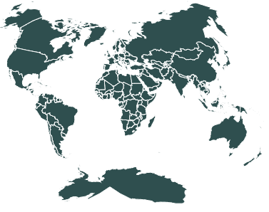
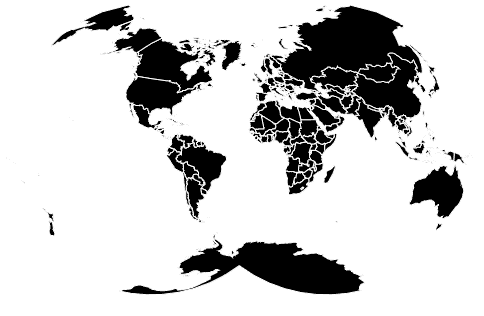

# D3.js geoVanDerGrinten4()功能

> 原文:[https://www . geesforgeks . org/D3-js-geovandergrinten 4-function/](https://www.geeksforgeeks.org/d3-js-geovandergrinten4-function/)

D3.js 是一个 JavaScript 库，用于在 web 浏览器中产生动态的、交互式的数据可视化。它利用了可伸缩矢量图形、HTML5 和级联样式表标准。

d3.js 中的 **geoVanDerGrinten4()函数**用于绘制范德格林顿四世投影。

**语法:**

```
d3.geoVanDerGrinten4()

```

**参数:**此方法不接受任何参数。

**返回值:**该方法根据给定的 JSON 数据创建 geoVanDerGrinten IV 投影。

**示例 1:** 以下示例绘制了以(0，0)为中心，0°旋转的范德格林顿 IV 世界投影。

## 超文本标记语言

```
<!DOCTYPE html>
<html lang="en">

<head>
    <meta charset="UTF-8" />
    <meta name="viewport" content=
        "width=device-width, initial-scale=1.0" />
    <script src="https://d3js.org/d3.v4.js">
    </script>
    <script src=
"https://d3js.org/d3-geo-projection.v2.min.js">
    </script>
</head>

<body>
    <div style="width:700px; height:600px;">
        <svg width="700" height="400">
        </svg>
    </div>

    <script>
        var svg = d3.select("svg"),
            width = +svg.attr("width"),
            height = +svg.attr("height");

        // VanDerGrinten4  projection
        // Center(0,0) and 0 rotation 
        var gfg = d3.geoVanDerGrinten4()
            .scale(width / 3.0 / Math.PI)
            .rotate([0, 0])
            .center([0, 0])
            .translate([width / 2, height / 2])

        // Loading the json data
        d3.json(
            "https://raw.githubusercontent.com/"
            + "janasayantan/datageojson/master/world.json",
            function (data) {
                // Draw the map
                svg.append("g")
                    .selectAll("path")
                    .data(data.features)
                    .enter().append("path")
                    .attr("fill", "DarkSlateGrey")
                    .attr("d", d3.geoPath()
                        .projection(gfg)
                    )
                    .style("stroke", "#ffff")
            })
    </script>
</body>

</html>
```

**输出:**



范德格林 4 世界投影，无旋转，以(0，0)为中心

**示例 2:** 以下示例绘制了 VanDerGrinten IV 改变中心和旋转后的世界投影。

## 超文本标记语言

```
<!DOCTYPE html>
<html lang="en">

<head>
    <meta charset="UTF-8" />
    <meta name="viewport" content="width=device-width, 
                initial-scale=1.0" />

    <script src="https://d3js.org/d3.v4.js">
    </script>
    <script src=
"https://d3js.org/d3-geo-projection.v2.min.js">
    </script>
</head>

<body>
    <div style="width:700px; height:600px;">
        <svg width="700" height="400">
        </svg>
    </div>

    <script>
        var svg = d3.select("svg"),
            width = +svg.attr("width"),
            height = +svg.attr("height");

        // VanDerGrinten4  projection
        // Center(10,10) and 25 degree 
        // rotation w.r.t  Y axis
        var gfg = d3.geoVanDerGrinten4()
            .scale(width / 3.0 / Math.PI)
            .rotate([25, 0])
            .center([10, 10])
            .translate([width / 2, height / 2])

        // Loading the json data
        // Used json file stored at 
        // https://raw.githubusercontent.com/janasayantan
        // /datageojson/master/world.json
        d3.json(
            "https://raw.githubusercontent.com/"
            + "janasayantan/datageojson/master/world.json",
            function (data) {
                // Draw the map
                svg.append("g")
                    .selectAll("path")
                    .data(data.features)
                    .enter().append("path")
                    .attr("fill", "Black")
                    .attr("d", d3.geoPath()
                        .projection(gfg)
                    )
                    .style("stroke", "#ffff")
            })
    </script>
</body>

</html>
```

**输出:**



VanDerGrinten4 投影，绕 Y 轴旋转 25 度，中心位于(10，10)