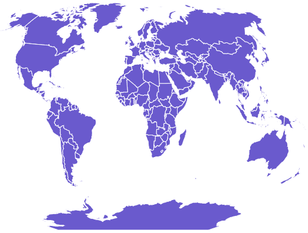
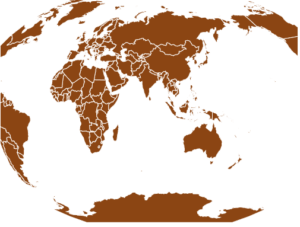

# D3.js geoWinkel3()功能

> 原文:[https://www.geeksforgeeks.org/d3-js-geowinkel3-function/](https://www.geeksforgeeks.org/d3-js-geowinkel3-function/)

D3.js 是一个 JavaScript 库，用于在 web 浏览器中产生动态的、交互式的数据可视化。它利用了可伸缩矢量图形、HTML5 和级联样式表标准。

d3.js 中的 **geoWinkel3()函数**用于绘制 Winkel 三重投影，这是一种折衷的修改后的世界地图方位角投影。它是艾托夫投影坐标和等距圆柱投影的算术平均值。众所周知，在小比例尺制图的折衷投影中，该投影具有最低的平均比例尺和面积失真。

**语法:**

```
d3.geoWinkel3()
```

**参数:**此方法不接受任何参数。

**返回值:**这个方法从给定的 JSON 数据创建并返回 Winkel3 投影。

**示例 1:** 以下示例进行世界的 Winkel3 投影，中心位于(0，0)，旋转 0°。

## 超文本标记语言

```
<!DOCTYPE html>
<html lang="en">

<head>
    <meta charset="UTF-8" />
    <meta name="viewport"
        content="width=device-width,
                initial-scale=1.0"/>

    <script src="https://d3js.org/d3.v4.js"></script>

    <script src=
"https://d3js.org/d3-geo-projection.v2.min.js">
    </script>
</head>

<body>
    <div style="width:700px; height:500px;">
        <svg width="600" height="450">
        </svg>
    </div>

    <script>
        var svg = d3.select("svg"),
            width = +svg.attr("width"),
            height = +svg.attr("height");

        // Winkel3 projection
        // Center(0,0) with 0 rotation
        var gfg = d3.geoWinkel3()
            .scale(width / 1.5 / Math.PI)
            .rotate([0,0])
            .center([0,0])
            .translate([width / 2, height / 2])

        // Loading the json data
        d3.json(
            "https://raw.githubusercontent.com/"
            +"janasayantan/datageojson/master/world.json",
            function(data){
                // Draw the map
                svg.append("g")
                    .selectAll("path")
                    .data(data.features)
                    .enter().append("path")
                    .attr("fill", "SlateBlue")
                    .attr("d", d3.geoPath()
                        .projection(gfg)
                    )
                    .style("stroke", "#ffff")
        });
    </script>
</body>

</html>
```

**输出:**



世界的 Winkel3 投影，无旋转，以(0，0)为中心

**示例 2:** 以下示例在自定义中心和旋转后，对世界进行 Winkel3 投影

## 超文本标记语言

```
<!DOCTYPE html>
<html lang="en">

<head>
    <meta charset="UTF-8" />
    <meta name="viewport"
        content="width=device-width,
                initial-scale=1.0"/>

    <script src="https://d3js.org/d3.v4.js"></script>

    <script src=
"https://d3js.org/d3-geo-projection.v2.min.js">
    </script>
</head>

<body>
    <div style="width:500px; height:600px;">
        <svg width="500" height="450">
        </svg>
    </div>

    <script>
        var svg = d3.select("svg"),
            width = +svg.attr("width"),
            height = +svg.attr("height");

        // Winkel3  projection
        // Center(-10,0) and -90 degree
        // rotation w.r.t Y axis
        var gfg = d3.geoWinkel3()
            .scale(width / 1.3 / Math.PI)
            .rotate([-90,0])
            .center([-10,0])
            .translate([width / 2, height / 2]);

        // Loading the json data
        d3.json(
            "https://raw.githubusercontent.com/"
            +"janasayantan/datageojson/master/world.json",
            function(data){
                // Draw the map
                svg.append("g")
                    .selectAll("path")
                    .data(data.features)
                    .enter().append("path")
                    .attr("fill", "SaddleBrown")
                    .attr("d", d3.geoPath()
                        .projection(gfg)
                    )
                    .style("stroke", "#ffff")
        })
    </script>
</body>

</html>
```

**输出:**

