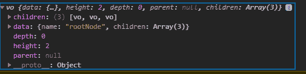
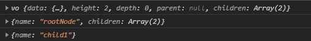

# D3.js 层次结构()功能

> 原文:[https://www.geeksforgeeks.org/d3-js-hierarchy-function/](https://www.geeksforgeeks.org/d3-js-hierarchy-function/)

**D3.js** 库中的 **d3.hierarchy()** 函数用于根据给定的层次数据构建根节点数据。给定的数据必须是对象的，并且必须表示根节点。

**语法:**

```
d3.hierarchy(data[, children]);
```

**参数:**该函数采用一个参数，如上所述，如下所述。

*   **数据:**该参数是表示分层数据的对象。

**返回值:**该函数返回一个对象。

下面是上面给出的函数的几个例子。

**例 1:**

## 超文本标记语言

```
<!DOCTYPE html>
<html lang="en">

<head>
    <meta charset="UTF-8" />
    <meta name="viewport" path1tent=
        "width=device-width, initial-scale = 1.0"/>
    <script src="https://d3js.org/d3.v4.min.js">
    </script>
</head>

<body>
    <script>
        var obj = d3.hierarchy({
            name: "rootNode",
            children: [
                {
                    name: "child1"
                },
                {
                    name: "child2",
                    children: [
                        { name: "grandChild1" },
                        { name: "grandChild2" },
                        { name: "grandChild3" },
                        { name: "grandChild4" }
                    ]
                },
                {
                    name: "child3",
                    children: [
                        { name: "grandChild5" },
                        { name: "grandChild6" },
                    ]
                }
            ]
        });
        console.log(obj);        
    </script>
</body>

</html>
```

**输出:**



**例 2:**

## 超文本标记语言

```
<!DOCTYPE html>
<html lang="en">

<head>
    <meta charset="UTF-8" />
    <meta name="viewport" path1tent=
        "width=device-width, initial-scale = 1.0"/>
    <script src="https://d3js.org/d3.v4.min.js">
    </script>
</head>

<body>
    <script>
        var obj = d3.hierarchy({
            name: "rootNode",
            children: [
                {
                    name: "child1"
                },
                {
                    name: "child2",
                    children: [
                        { name: "grandChild1" },
                    ]
                }
            ]
        });
        console.log(obj);
        console.log(obj.data);
        console.log(obj.data.children[0]);        
    </script>
</body>

</html>
```

**输出:**

