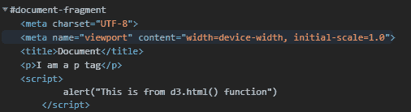
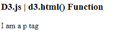

# D3.js html()函数

> 原文:[https://www.geeksforgeeks.org/d3-js-html-function/](https://www.geeksforgeeks.org/d3-js-html-function/)

d3.js 中的 **d3.html()** 函数用于获取和读取 html 类型的文件。它首先以文本形式获取文件，然后以 HTML 形式解析文件。

**语法:**

```
d3.html(input[, init]);
```

**参数:**该函数接受两个参数，如上所述，如下所述:

*   **输入:**此参数为输入文件的地址。
*   **init:** 该参数取一个函数。

**注意:**请先创建一个名为 sample.html 的文件，然后查看下面给出的示例。

**示例 1:** **文件名:sample.html**

```
<!DOCTYPE html>
<html lang="en">

<head>
    <meta charset="UTF-8">
    <meta name="viewport" content=
        "width=device-width, 
        initial-scale=1.0">
</head>

<body>
    <p>I am a p tag</p>
    <script>
        alert("This is from d3.html() function")
    </script>
</body>

</html>
```

**文件名:index.html**

```
<!DOCTYPE html>
<html lang="en">

<head>
    <meta charset="UTF-8" />
    <meta name="viewport" path1tent=
        "width=device-width, initial-scale=1.0"/>
    <script src="https://d3js.org/d3.v4.min.js">
    </script>
</head>

<body>
    <script>
        d3.html("sample.html", function (d) {
            console.log(d);
        });
    </script>
</body>

</html>
```

**输出:**
[](https://media.geeksforgeeks.org/wp-content/uploads/20200822142606/01110.png)

**示例 2:** **文件名:sample.html**

```
<html lang="en">
<head>
    <meta charset="UTF-8">
    <meta name="viewport" content=
        "width=device-width,
         initial-scale=1.0">
    <title>Document</title>
</head>
<body>
    <h3>D3.js | d3.html() Function</h3>
    <p>I am a p tag</p>
</body>
</html>
```

**文件名:index.html**

```
<!DOCTYPE html>
<html lang="en">

<head>
    <meta charset="UTF-8" />
    <meta name="viewport" path1tent=
        "width=device-width,initial-scale=1.0"/>
</head>

<body>
    <script src="https://d3js.org/d3.v4.min.js">
    </script>
    <script>
        d3.html("sample.html", function (d) {
            d = [].map.call(d.querySelectorAll("p"), (p) => {
                var h3 = d.querySelector("h3");
                document.write(`<h3>${h3.textContent}</h3>`);
                document.write(`<p>${p.textContent}</p>`);
            })
        });
    </script>
</body>

</html>
```

**输出:**

[](https://media.geeksforgeeks.org/wp-content/uploads/20200822144041/01111.png)