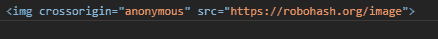
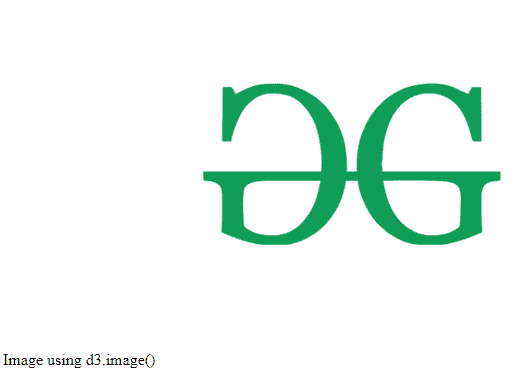

# D3.js 图像()功能

> 原文:[https://www.geeksforgeeks.org/d3-js-image-function/](https://www.geeksforgeeks.org/d3-js-image-function/)

D3.js 中的 **d3.image()** 函数是请求 API 的一部分，用于从任何给定的图像 URL 中获取图像。如果函数中也给出了 init，那么它会在加载图像之前设置图像的任何附加属性。

**语法:**

```
d3.image(input[, init]);

```

**参数:**该函数接受如上所述的单个参数，如下所述:

*   **输入:**取待取图像的地址。

**返回值:**从图像 URL 返回图像。

下面的例子说明了 JavaScript 中的 D3.js 图像()函数。

**示例 1:**

## 超文本标记语言

```
<!DOCTYPE html>
<html lang="en">
    <head>
        <meta charset="UTF-8" />
        <meta
            name="viewport"
            path1tent="width=device-width, 
                       initial-scale=1.0"/>
        <title>D3.js image() Function</title>
    </head>
    <style></style>
    <body>
        <script src=
"https://d3js.org/d3.v4.min.js">
        </script>
        <script src=
"https://d3js.org/d3-dsv.v1.min.js">
        </script>
        <script src=
"https://d3js.org/d3-fetch.v1.min.js">
        </script>

        <script>
            d3.image("https://robohash.org/image", 
                     { crossOrigin: "anonymous" }).then((img) => {
                console.log(img);
            });
        </script>
    </body>
</html>
```

**输出:**



**例 2:**

## 超文本标记语言

```
<!DOCTYPE html>
<html lang="en">
    <head>
        <meta charset="UTF-8" />
        <meta
            name="viewport"
            path1tent="width=device-width, 
                       initial-scale=1.0"/>
        <title>D3.js image() Function</title>
    </head>
    <style></style>
    <body>
        <script src=
"https://d3js.org/d3.v4.min.js">
        </script>
        <script src=
"https://d3js.org/d3-dsv.v1.min.js">
        </script>
        <script src=
"https://d3js.org/d3-fetch.v1.min.js">
        </script>

        <script>
            d3.image(
`https://pbs.twimg.com/profile_images/1138375574726955008/1fNUyEdv_400x400.png`, 
              { crossOrigin: "anonymous" }).then((img) => {
                document.body.append("Image using d3.image()");
                document.body.append(img);
            });
        </script>
    </body>
</html>
```

**输出:**

