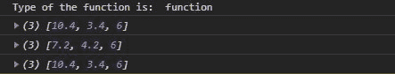
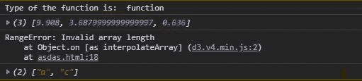

# D3.js 插值。数组()函数

> 原文:[https://www . geesforgeks . org/D3-js-INTERPOL-array-function/](https://www.geeksforgeeks.org/d3-js-interpolate-array-function/)

**d3。插值光线()**用于对两个数组进行插值，并返回它们之间的插值器。

**语法:**

```
d3.interpolateArray(a, b);
```

**参数:**取两个参数。

*   **a:** 是数组。
*   **b:** 是数组。

**返回:**返回插值函数。

下面给出了插值光线()函数的几个例子。

**例 1:**

```
<!DOCTYPE html>
<html lang="en">
<head>
  <meta charset="UTF-8">
  <meta name="viewport"
        content="width=device-width,
                 initial-scale=1.0">
  <title>Document</title>
</head>
<style>
</style>
<body>
  <!--fetching from CDN of D3.js -->
  <script type = "text/javascript" 
          src = 
"https://d3js.org/d3.v4.min.js">
   </script>
  <script>
    console.log("Type of the function is: ", 
typeof(d3.interpolateArray([12, 3], [4, 5, 6])))
    console.log(d3.interpolateArray([12, 3], [4, 5, 6])(0.2))
    console.log(d3.interpolateArray([12, 3], [4, 5, 6])(0.6))
    console.log(d3.interpolateArray([12, 3], [4, 5, 6])(0.2))
  </script>
</body>
</html>
```

**输出:**



**例 2:**

当的元素不是数字时。

```
<!DOCTYPE html>
<html lang="en">
<head>
  <meta charset="UTF-8">
  <meta name="viewport" 
        content="width=device-width,
                 initial-scale=1.0">
  <title>Document</title>
</head>
<style>
</style>
<body>
  <!--fetching from CDN of D3.js -->
  <script type = "text/javascript"
          src = 
"https://d3js.org/d3.v4.min.js">
  </script>
  <script>
    console.log("Type of the function is: ", 
typeof(d3.interpolateArray([12, 3], [4, 5, 6])))

    console.log(
d3.interpolateArray([12.25, 3.36], [0.54, 5, .636])(0.2));

    // This will give error as it is not an array  
    try{
      console.log(d3.interpolateArray(1452, 63244)(0.6))
    }
    catch(err){
        console.log(err)
    }
    console.log(
d3.interpolateArray(["a", "b", "d"], ["a", "c"])(0.2));
  </script>
</body>
</html>
```

**输出:**

