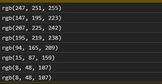
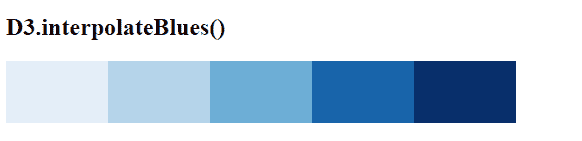

# D3.js 插值值()函数

> 原文:[https://www . geeksforgeeks . org/D3-js-interpoleblues-function/](https://www.geeksforgeeks.org/d3-js-interpolateblues-function/)

d3.js 中的 **d3 .插值蓝色()**函数用于返回一个对应于“蓝色”顺序配色方案的 RGB 颜色字符串。

**语法:**

```
d3.interpolateBlues(t);
```

**参数:**该函数只取一个参数，上面给出，下面描述:

*   **t:** 这是一个介于 0 和 1 之间的数字。

**返回值:**这个函数返回一个颜色的 RGB 字符串。

下面给出了上述函数的几个例子。

**例 1:**

```
<!DOCTYPE html> 
<html lang="en"> 
<head> 
<meta charset="UTF-8"> 
<meta name="viewport"
        content="width=device-width, 
                initial-scale=1.0"> 
<title>Document</title> 
</head> 
<style> 
</style> 
<body>
<!--Fetching from CDN of D3.js -->
  <script src = 
  "https://d3js.org/d3.v4.min.js"> 
  </script> 
  <script src=
  "https://d3js.org/d3-color.v1.min.js">
  </script>
  <script src=
  "https://d3js.org/d3-interpolate.v1.min.js">
  </script>
  <script src=
  "https://d3js.org/d3-scale-chromatic.v1.min.js">
  </script>
  <script> 
    console.log(d3.interpolateBlues(0));
    console.log(d3.interpolateBlues(0.4));
    console.log(d3.interpolateBlues(0.2));
    console.log(d3.interpolateBlues(0.25));
    console.log(d3.interpolateBlues(0.54));
    console.log(d3.interpolateBlues(0.85));
    console.log(d3.interpolateBlues(2));
    console.log(d3.interpolateBlues(1));
  </script> 
</body> 
</html>
```

**输出:**



**例 2:**

```
<!DOCTYPE html> 
<html lang="en"> 
<head> 
<meta charset="UTF-8"> 
<meta name="viewport"
        content="width=device-width, 
                initial-scale=1.0"> 
<title>Document</title> 
</head> 
<style> 
div{ 
  padding:6px;
  text-align: center;
  vertical-align: middle;
  display: flex;
  justify-content: center;
  width: 90px; 
  height: 50px; 
  float: left;
} 
</style> 
<body> 
  <h2>D3.interpolateBlues() </h2>
<div class="box1"> 
  <span>
  </span>
</div> 
<div class="box2"> 
  <span> 
  </span>
</div> 
<div class="box3"> 
  <span> 
  </span>
</div> 
<div class="box4"> 
  <span> 
  </span>
</div> 
<div class="box5"> 
  <span> 
  </span>
</div> 
<!--Fetching from CDN of D3.js -->
  <script src = 
  "https://d3js.org/d3.v4.min.js"> 
  </script> 
  <script src=
  "https://d3js.org/d3-color.v1.min.js">
  </script>
  <script src=
  "https://d3js.org/d3-interpolate.v1.min.js">
  </script>
  <script src=
  "https://d3js.org/d3-scale-chromatic.v1.min.js">
  </script>
  <script> 
    // creating different colors for different
    // Values of t is 0.1
    let color1= 
    d3.interpolateBlues(0.1); 
    // Values of t is 0.3
    let color2= 
    d3.interpolateBlues(0.3); 
    // Values of t is 0.5
      let color3= 
    d3.interpolateBlues(0.5); 
    // Values of t is 0.8
      let color4= 
    d3.interpolateBlues(0.8); 
    // Values of t is 1.0
      let color5= 
    d3.interpolateBlues(1.0);

    // Selecting Div using query selector
    let box1=document.querySelector(".box1"); 
    let box2=document.querySelector(".box2"); 
    let box3=document.querySelector(".box3"); 
    let box4=document.querySelector(".box4"); 
    let box5=document.querySelector(".box5"); 

    // Setting style and BG color of the particular DIVs
    box1.style.backgroundColor=color1; 
    box2.style.backgroundColor=color2; 
    box3.style.backgroundColor=color3; 
    box4.style.backgroundColor=color4; 
    box5.style.backgroundColor=color5; 
  </script> 
</body> 
</html>
```

**输出:**

