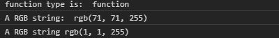
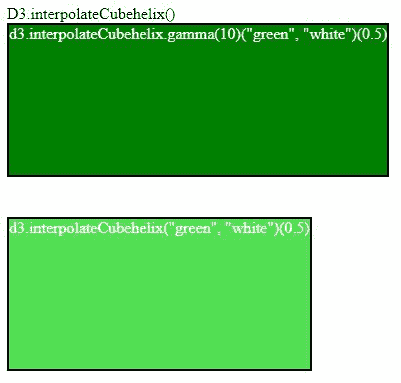

# D3.js 插值 ecbehelix()函数

> 原文:[https://www . geeksforgeeks . org/D3-js-interprecebucheelix-function/](https://www.geeksforgeeks.org/d3-js-interpolatecubehelix-function/)

D3.js 中的 **d3 .插值 ecbehelix()**函数用于返回立方螺旋颜色空间插值函数。它采用两种颜色作为参数。

**语法:**

```
d3.interpolateCubehelix(a, b);
```

或者

```
d3.interpolateCubehelix.gamma(k)(a, b);
```

**参数:**取两个参数。

*   答:它是数据类型字符串颜色的名称。
*   b:也是字符串类型颜色的名称。

**返回:**返回插值函数。

下面给出了上述函数的几个例子。

**例 1:**

```
<!DOCTYPE html>
<html lang="en">
<head>
  <meta charset="UTF-8">
  <meta name="viewport" 
        content="width=device-width, 
                 initial-scale=1.0">
  <title>Document</title>
</head>
<style>
</style>
<body>
  <!--fetching from CDN of D3.js -->
  <script type = "text/javascript" 
          src = "https://d3js.org/d3.v4.min.js">
  </script>
  <script>
    // Printing the return type of the function
    console.log(
"function type is: ", typeof(d3.interpolateCubehelix("blue", "white")))
    // Using function d3.interpolateCubehelix()
    console.log(
"A RGB string: ", d3.interpolateCubehelix("blue", "white")(0.5))
    //using gamma
    console.log(
"A RGB string", d3.interpolateCubehelix.gamma(2)("blue", "white")(0.2))
  </script>
</body>
</html>
```

**输出:**



**例 2:**

```
<!DOCTYPE html>
<html lang="en">
<head>
  <meta charset="UTF-8">
  <meta name="viewport" 
        content="width=device-width, 
                 initial-scale=1.0">
  <title>Document</title>
</head>
<style>
  .box1, .box2{
    display: flex;
    margin-bottom: 40px;
    color: white;
    border: 2px solid black;
    width: fit-content;
    height: 150px;
  }
</style>
<body>
  D3.interpolateCubehelix()
  <div>
    <div class="box1">
d3.interpolateCubehelix.gamma(10)("green", "white")(0.5)
    </div>
    <div class="box2">
d3.interpolateCubehelix("green", "white")(0.5)
    </div>
  </div>
  <!--fetching from CDN of D3.js -->
  <script type = "text/javascript" 
          src = "https://d3js.org/d3.v4.min.js">
  </script>
  <script>
    let box1=document.querySelector(".box1");
    let box2=document.querySelector(".box2");
    // Please note the effect of gamma
    let color=
d3.interpolateCubehelix.gamma(10)("green", "white")(0.5);
    let color2=
d3.interpolateCubehelix("green", "white")(0.5); 
    // Changing css of the div with class-name box1
    box1.style.backgroundColor=color;
    // Changing css of the div with class-name box2
    box2.style.backgroundColor=color2;
  </script>
</body>
</html>
```

**输出:**

