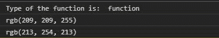
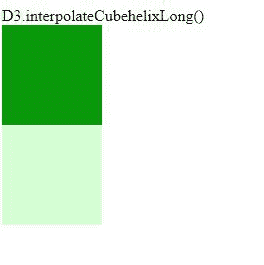

# D3.js 插值 ecbehelixlong()函数

> 原文:[https://www . geeksforgeeks . org/D3-js-interprecephelixlong-function/](https://www.geeksforgeeks.org/d3-js-interpolatecubehelixlong-function/)

**d3 .插值 ecupheelixlong()**函数用于返回两个给定颜色 A 和 b 之间的立方体螺旋颜色空间插值器。它使用色调之间的最短路径。

**语法:**

```
d3.interpolateCubehelixLong(a, b);

```

**参数:**取上面给定的和下面描述的两个参数。

*   **a:** 是字符串格式的颜色名称。
*   **b:** 也是字符串格式的颜色名称。

**返回值:**返回函数。

**例 1:**

## 超文本标记语言

```
<!DOCTYPE html>
<html lang="en">

<head>
    <meta charset="UTF-8">
    <meta name="viewport" content=
        "width=device-width,initial-scale=1.0">

    <!--Fetching from CDN of D3.js -->
    <script type="text/javascript" 
        src="https://d3js.org/d3.v4.min.js">
    </script>
</head>

<body>

    <script>
        console.log("Type of the function is: ",
            typeof(d3.interpolateCubehelixLong("white", "red")))

        console.log(
            d3.interpolateCubehelixLong("blue", "white")(0.9))

        console.log(
            d3.interpolateCubehelixLong("white", "green")(0.1)) 
    </script>
</body>

</html>
```

**输出:**



**例 2:**

## 超文本标记语言

```
<!DOCTYPE html>
<html lang="en">

<head>
    <meta charset="UTF-8">
    <meta name="viewport" content=
        "width=device-width,initial-scale=1.0">

      <!--Fetching from CDN of D3.js -->
    <script type="text/javascript" 
        src="https://d3js.org/d3.v4.min.js">
    </script>

    <style>
        .bx1,
        .bx2 {
            width: 100px;
            height: 100px;
        }
    </style>
</head>

<body>

<p>D3.interpolateCubehelixLong()</p>

    <div class="bx1"></div>
    <div class="bx2"></div>

    <script>
        let color1 =
            d3.interpolateCubehelixLong("green", "white")(0.1)
        let color2 =
            d3.interpolateCubehelixLong("white", "green")(0.1)
        let bx1 = document.querySelector(".bx1");
        bx1.style.backgroundColor = color1;
        let bx2 = document.querySelector(".bx2");
        bx2.style.backgroundColor = color2; 
    </script>
</body>

</html>
```

**输出:**注意给出绿色作为第一个参数和给出白色作为第一个参数的区别。

